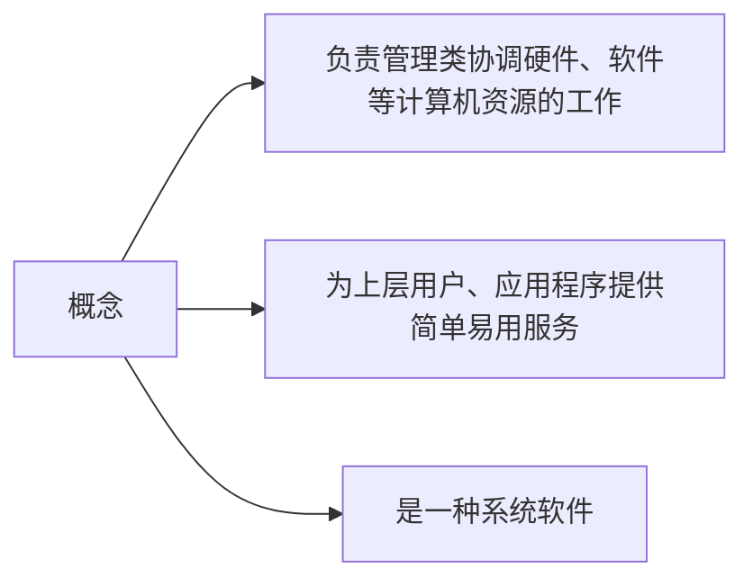
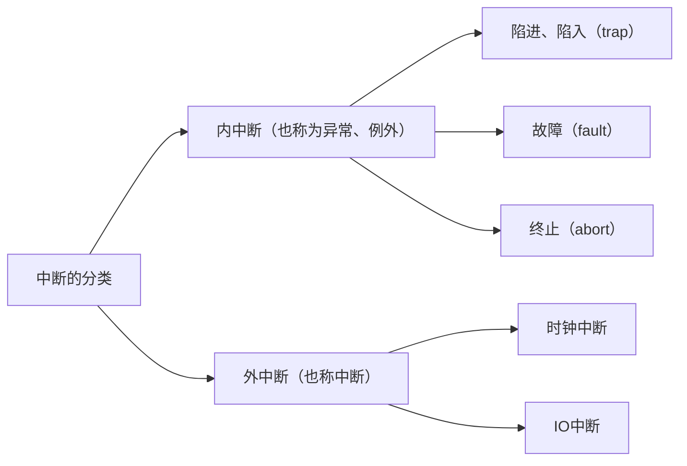
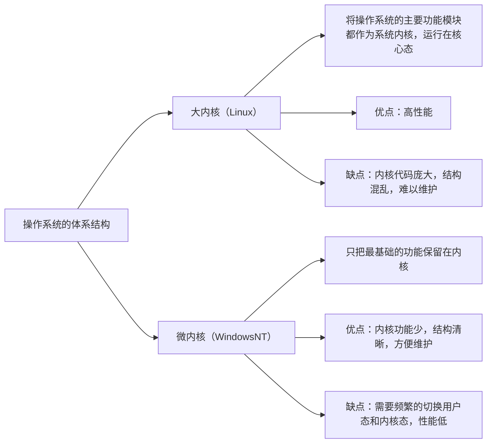
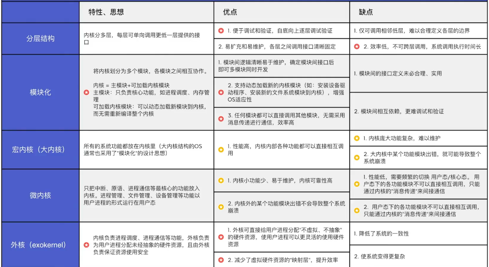
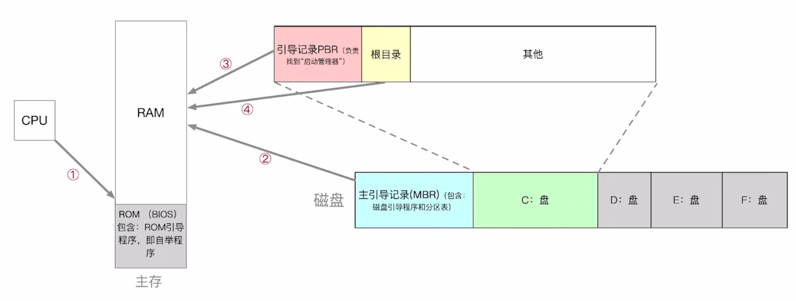
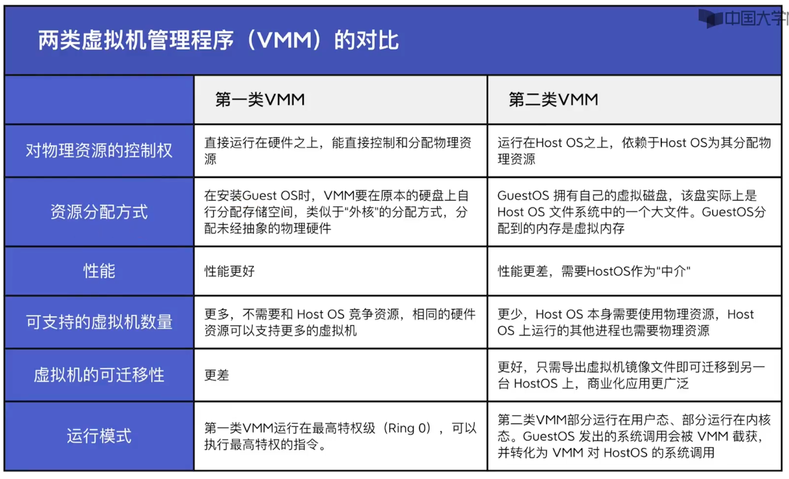

# 概述

## 操作系统定义

## 操作系统的功能和目标

资源的管理者: 处理机管理 存储管理 文件管理 设备管理

向上层提供服务:
- 普通用户
  - GUI用户图形界面
  - 命令接口
    - 联机命令接口 一次处理一条命令
    - 脱机命令接口 一次处理一堆命令
- 给程序/管理员的
  - 程序接口（即系统调用）

对硬件机器的扩展 -> 把覆盖了软件的机器称为扩充机器（虚拟机）

## 操作系统特征
并发和共享互为存在条件
`并发`和`共享`最基本的两个性质
没有并发和共享, 就谈不上虚拟和异步
- 并发:
  - 并发concurrent: 两个或多个事件在同一时间间隔内发送【同一时间间隔】
  - 并行parallel: 系统具有同时进行运算或操作的特性【同一时刻】

- 共享: 指系统中的资源可供内存中多个并发执行的程序共同使用
  - 互斥共享方式: A用完后B才可以用（如摄像头）
  - 同时共享方式: 一段时间内由多个进程同时访问（硬盘资源共享）

- 虚拟: 把一个物理上的实体变为若干逻辑上的对应物
  - 空分复用技术: 虚拟的扩充空间（如虚拟存储技术）
  - 时分复用技术: 虚拟的扩充时间（如虚拟处理器技术）

- 异步: 进程的执行不是一贯到底的, 而是走走停停的, 它以不可预知的速度向前推进

## OS发展与分类
- 手工操作阶段
  - 缺点: 人机速度矛盾
- 批处理阶段
  - 单道批处理系统（引入脱机输入输出技术）
    - 优点: 缓解人机速度矛盾
    - 缺点: 资源利用率依然很低
  - 多道批处理系统（操作系统开始出现）
    - 优点: 多道程序并发执行, 资源利用率高
    - 缺点: 不提供人机交互能力
- 分时操作系统
  - 优点: 提供人机交互能力
  - 缺点: 不能优先处理紧急任务
- 实时操作系统 优点: 能优先处理紧急任务
  - 硬实时操作系统: 必须在绝对严格的规定时间内完成处理
  - 软实时操作系统: 能偶尔违法时间规定
- 网络操作系统 -> 有主从关系
- 分布式操作系统 -> 无主从关系
- 个人计算机操作系统

## 操作系统运行环境
### 操作系统的运行机制
两类程序: 内核程序和应用程序 
两类指令: 特权指令和非特权指令 
两种处理器状态: 用户态（目态）和内核态（核心态/管态） 

- 用户态 -> 内核态: 一条修改PSW的特权指令
- 内核态 -> 用户态: 由中断引起, 硬件自动完成

### 中断和异常
内中断当前指令引起, 外中断与当前指令无关

陷入: 由指令引发, 比如程序想要调用操作系统内核的服务（陷入指令本身是非特权指令） 
故障: 由错误条件引起, 可能被内核程序修复, 让他继续执行, 如缺页故障 
终止: 由致命错误引起, 内核程序无法修复, 如整数除以0, 非法使用特权指令 

**中断机制的基本原理** 
内中断: CPU在执行指令时会检查是否有异常发生 
外中断: 每个指令周期末尾, CPU都会检查是否有中断信号需要处理 
通过"中断向量表"来找到相应的中断处理程序 
处理过程 
硬件自动完成: 关中断 -> 保存断点 -> 中断服务程序寻址 
中断程序完成: 保护现场和屏蔽字 -> 开中断 -> 执行中断服务程序 -> 关中断 -> 恢复现场和屏蔽字 -> 开中断 中断返回 

### 系统调用
什么是系统调用? 
操作系统对应用程序/程序员提供的接口 
系统调用和库函数的区别? 
有的库函数是对系统调用的进一步封装，而有的库函数没有使用系统调用 
什么功能需要使用系统调用? 
设备管理 文件管理 进程控制 进程通信 内存管理 
系统调用过程 
传参 -> 执行陷入指令/Trap/访管指令 -> 有内核程序处理系统调用请求 -> 返回应用程序 

## 操作系统体系结构

新增分层、模块化、外核操作系统结构：

## 操作系统的引导

1️⃣ CPU从一个特定主存地址开始，取指令，执行ROM（BIOS）中的引导程序（先进行硬件自检，再开机） 
2️⃣ 将磁盘的`主引导记录`（MBR）读入内存，执行磁盘引导程序，扫描分区表 
3️⃣ 从活动分区（又称主分区，即安装了操作系统的分区一般的C:）读入分区引导记录（PBR），执行其中的程序 
4️⃣ 从根目录下找到完整的操作系统初始化程序（即启动管理器）并执行，完成"开机"的一系列动作 

## 虚拟机
使用虚拟化技术，将一台物理机器虑拟化为多台虚拟机器(Virtual Machine)，每个虚拟机器都可以独立运行一个操作系统

