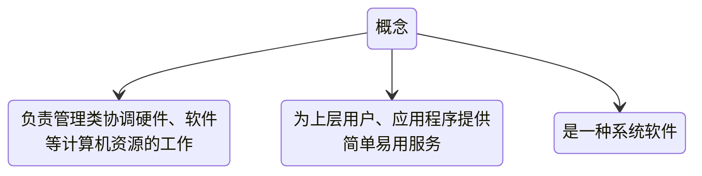

# 概述

## 操作系统定义

## 操作系统的功能和目标

资源的管理者: 处理机管理 存储管理 文件管理 设备管理

向上层提供服务:
- 普通用户
  - GUI用户图形界面
  - 命令接口
    - 联机命令接口 一次处理一条命令
    - 脱机命令接口 一次处理一堆命令
- 给程序/管理员的
  - 程序接口（即系统调用）

对硬件机器的扩展 -> 把覆盖了软件的机器称为扩充机器（虚拟机）

## 操作系统特征
并发和共享互为存在条件
`并发`和`共享`最基本的两个性质
没有并发和共享，就谈不上虚拟和异步
- 并发:
  - 并发concurrent：两个或多个事件在同一时间间隔内发送【同一时间间隔】
  - 并行parallel：系统具有同时进行运算或操作的特性【同一时刻】

- 共享: 指系统中的资源可供内存中多个并发执行的程序共同使用
  - 互斥共享方式: A用完后B才可以用（如摄像头）
  - 同时共享方式: 一段时间内由多个进程同时访问（硬盘资源共享）

- 虚拟: 把一个物理上的实体变为若干逻辑上的对应物
  - 空分复用技术: 虚拟的扩充空间（如虚拟存储技术）
  - 时分复用技术: 虚拟的扩充时间（如虚拟处理器技术）

- 异步: 进程的执行不是一贯到底的，而是走走停停的，它以不可预知的速度向前推进

## OS发展与分类
- 手工操作阶段
  - 缺点：人机速度矛盾
- 批处理阶段
  - 单道批处理系统（引入脱机输入输出技术）
    - 优点：缓解人机速度矛盾
    - 缺点：资源利用率依然很低
  - 多道批处理系统（操作系统开始出现）
    - 优点：多道程序并发执行，资源利用率高
    - 缺点：不提供人机交互能力
- 分时操作系统
  - 优点：提供人机交互能力
  - 缺点：不能优先处理紧急任务
- 实时操作系统 优点：能优先处理紧急任务
  - 硬实时操作系统：必须在绝对严格的规定时间内完成处理
  - 软实时操作系统：能偶尔违法时间规定
- 网络操作系统
- 分布式操作系统
- 个人计算机操作系统
