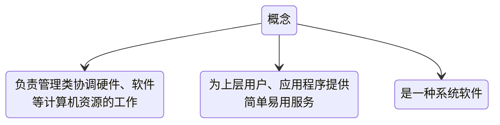

# 概述

## 操作系统定义

## 操作系统的功能和目标

资源的管理者: 处理机管理 存储管理 文件管理 设备你管理

向上层提供服务:
- 普通用户
  - GUI用户图形界面
  - 命令接口
    - 联机命令接口 一次处理一条命令
    - 脱机命令接口 一次处理一堆命令
- 给程序/管理员的
  - 程序接口（即系统调用）

对硬件机器的扩展 -> 把覆盖了软件的机器称为扩充机器（虚拟机）
