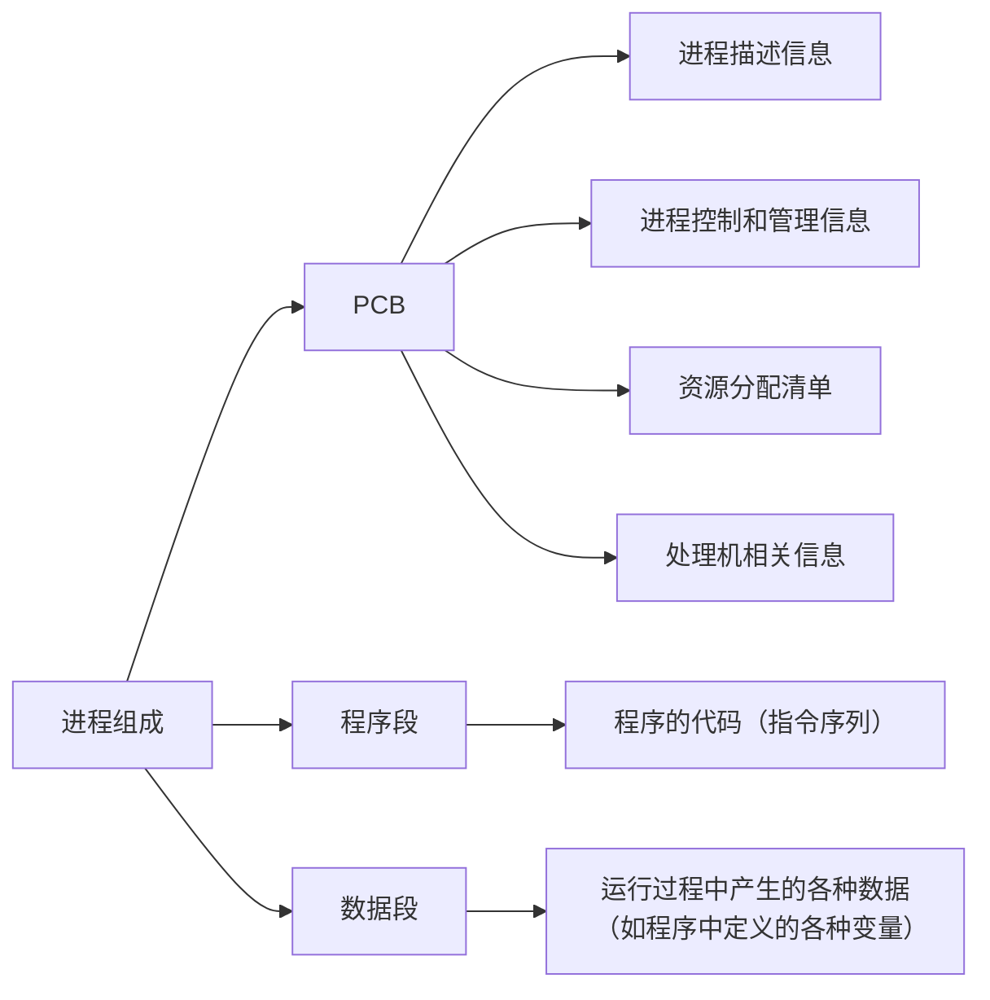

# 进程与线程

## 进程与线程
### 进程的概念与特征
进程是进程实体的运行过程，是系统进行资源分配和调度的一个独立单位

```mermaid
flowchart LR
  A[进程组成]
  B[PCB]
  C[进程描述信息]
  D[进程控制和管理信息]
  E[资源分配清单]
  F[处理机相关信息]
  G[程序段]
  H[程序的代码（指令序列）]
  I[数据段]
  J[运行过程中产生的各种数据（如程序中定义的各种变量）]
  A --> B
  A --> G
  A --> I
  B --> C
  B --> D
  B --> E
  B --> F
  G --> H
  I --> J
```
PCB给操作系统用的
程序段、数据段给进程自己用的

特征:动态性、并发性、独立性、异步性、结构性
动态性是最基础的特性

### 进程的状态与转换
