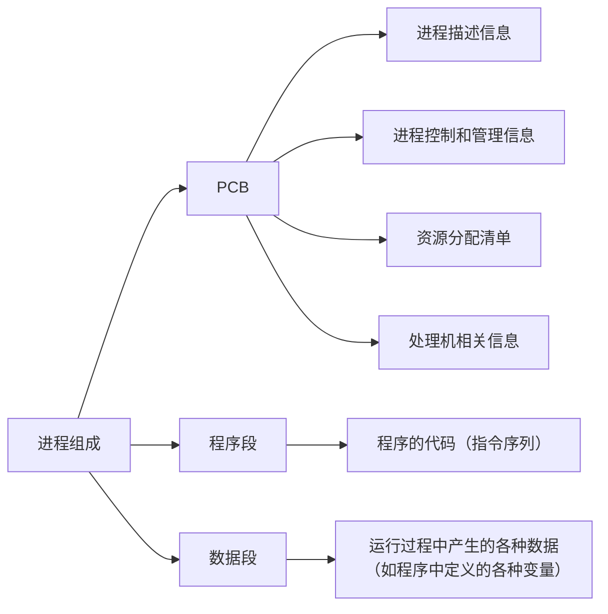
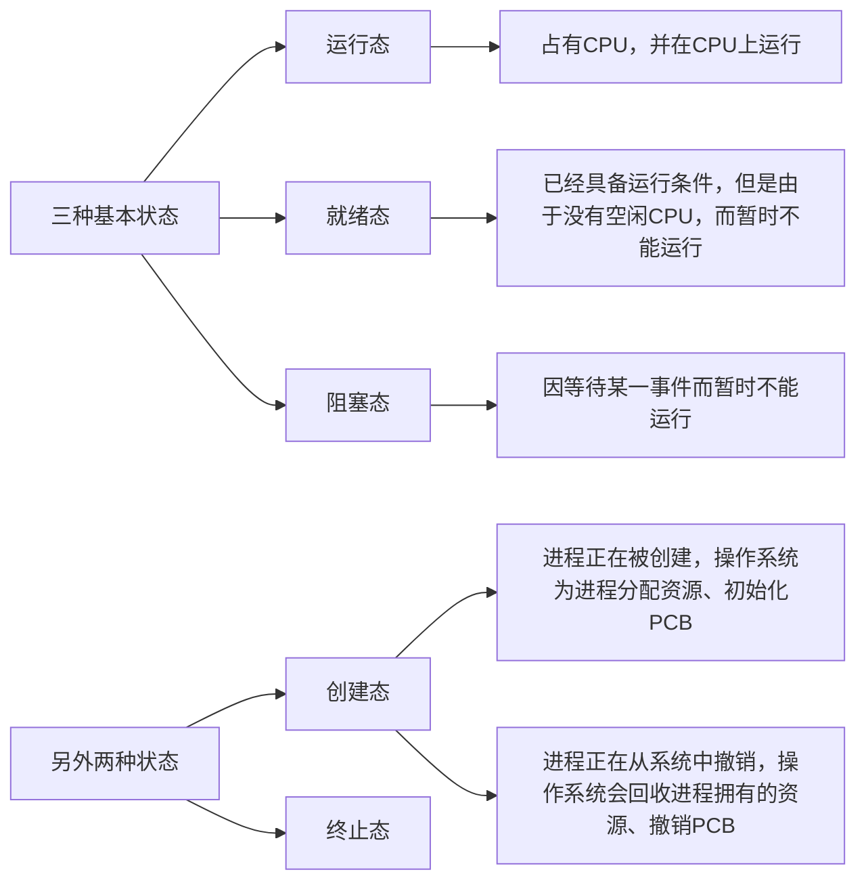
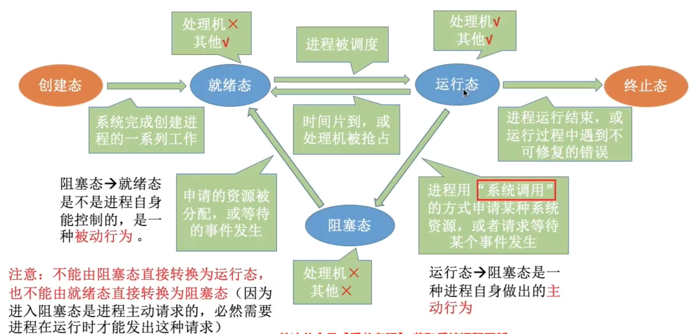
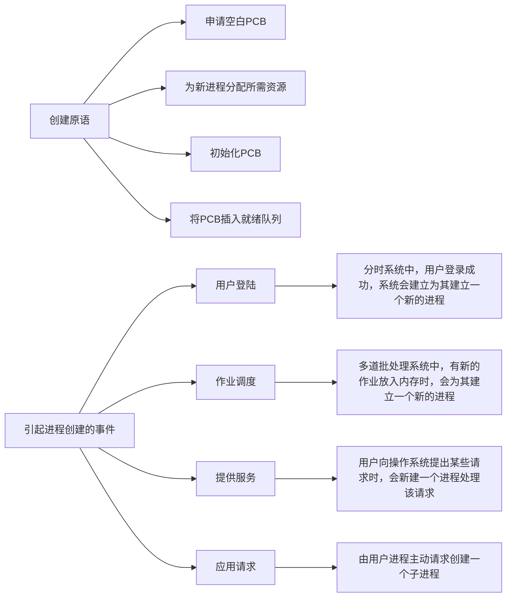
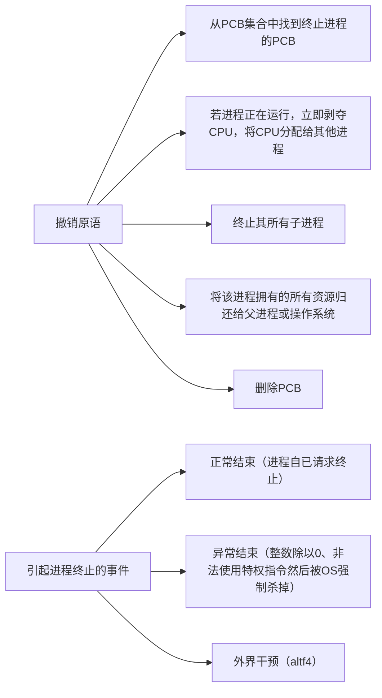
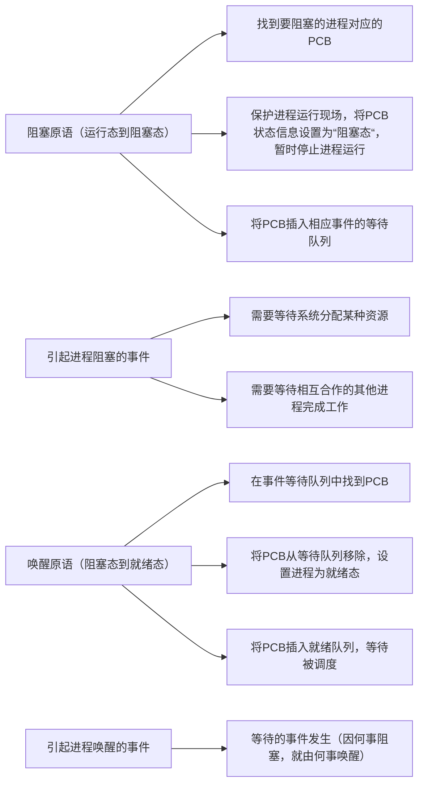
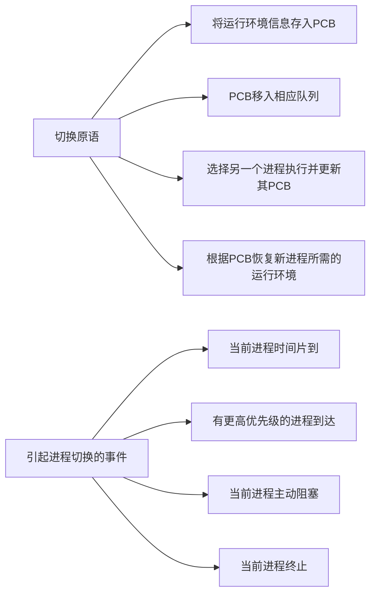
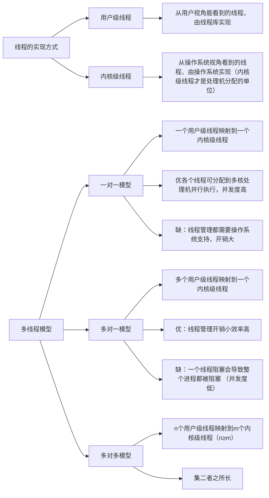
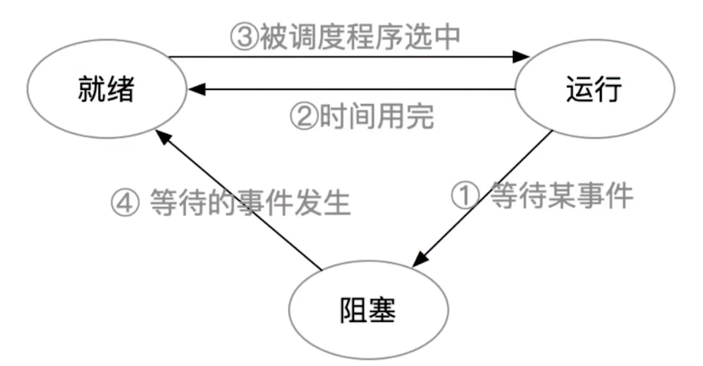

# 进程管理

## 进程与线程
### 进程的概念与特征
进程是进程实体的运行过程，是系统进行资源分配和调度的一个独立单位

PCB给操作系统用的 
程序段、数据段给进程自己用的 

特征: 动态性、并发性、独立性、异步性、结构性 
动态性是最基础的特性 

### 进程的状态与转换

进程PCB中会有一个`变量state`来表示进程当前状态

进程的转换:

进程的组织（大多是链式的）:
- 链接方式
  - 按照进程状态将PCB分为多个队列
  - 操作系统持有指向各个队列的指针
- 索引方式
  - 根据进程状态的不同，建立几张索引表
  - 操作系统持有指向各个索引表的指针

### 进程控制
进程的创建、终止、阻塞、唤醒的过程

#### 创建

#### 终止

#### 阻塞与唤醒

#### 切换

无论哪个进程控制原语，要做无非三件事：
1. 更新PCB中的信息
2. 将PCB插入合适的队列
3. 分配/回收资源

进程的控制为什么需要一气呵成？ 
如果不能一气呵成就有可能导致操作系统中某些关键数据结构信息不统一的情况，这会影响操作系统进行别的管理工作 
怎么实现原语的原子性的？ 
使用关中断和开中断这两个特权指令实现原子性 

### 进程通信
进程通信指的是进程间的信息交换
有共享存储、消息传递、管道通信三种通信方法
1. 共享存储
  - 设置一个共享内存区域，并映射到进程的虚拟地址空间
  - 要互斥地访问共享空间（由通信进程自己负责实现互斥）
  - 两种方式：
    - 基于数据结构（低级）
    - 基于存储区的共享（高级）
2. 消息传递
  - 传递结构化的消息（消息头/消息体）
  - 系统提供“发送/接受原语”
  - 两种方式：
    - 直接通信（直接发送消息到接收进程的消息队列里）
    - 间接（信箱）通信方式（消息先发到中间体，即信箱，另一个进程再从信箱里去数据）
3. 管道通信
  - 设置一个特殊的共享文件（管道），其实就是一个内存缓冲区
  - 一个管道只能实现伴双工通信 实现双向同时通信要建立两个管道
  - 各进程要互斥访问管道（由操作系统负责实现互斥）
  - 管道写满时，写进程阻塞。管道读空时，读进程阻塞

王道书中的错误：并不是只有管道数据满时，才能读取数据

### 线程的概念与特点
线程是进程的一部分 
传统进程机制中，进程是资源分配、调度的基本单位 
引入线程后，线程是`调度的基本单位`，进程是资源分配的基本单位 

传统机器只能进程间并发，引入线程后，各线程间也能并发 

传统的进程间并发需要切换进程运行环境，系统开销很大 
引入线程后，在同一进程中的线程切换，不需要切换进程运行环境，开销小 

线程的属性：
  - 多CPU计算机中，各个线程可占用不同的CPU
  - 每个线程都有一个线程ID，线程控制块（TCB）
  - 线程也有就绪、阻塞、运行三种基本状态
  - 线程几乎不拥有系统资源，同一进程的不同线程间共享进程的资源
  - 同一进程的线程通信无需操作系统干预

### 线程的实现方式和多线程模型

### 线程的状态与转换
TCB（线程控制块）大概有如下信息：
  - 线程标识符（TID，与PID类似）
  - 程序计数器PC（线程目前运行到哪）
  - 其他寄存器（线程运行的中间结果）
  - 堆栈指针（保存函数调用信息、局部变量等）
  - 线程运行状态（就绪、运行、阻塞）
  - 优先级（线程调度、资源分配的参考）
线程的组织就是使各种TCB根据不同系统来分门别类的组织起来
线程的控制就是各种状态之间的转换

---

## 处理机调度
