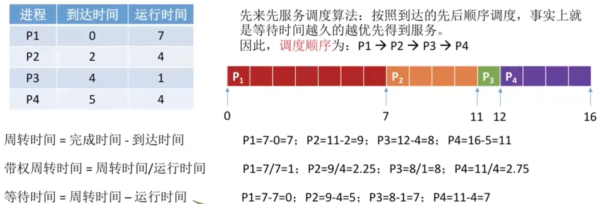
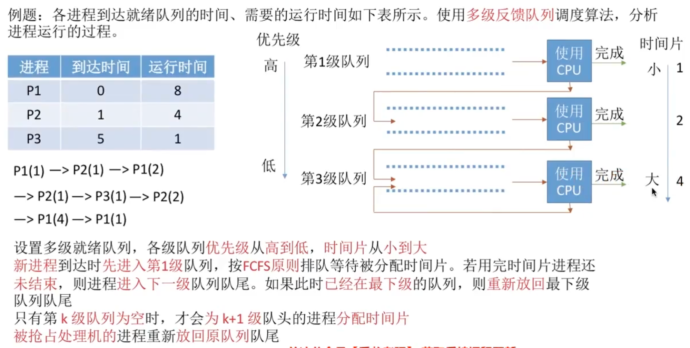
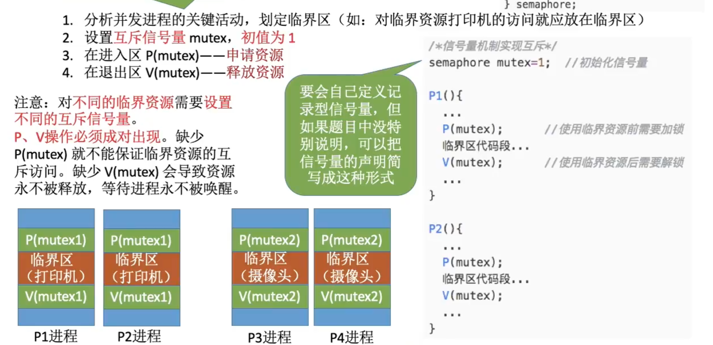
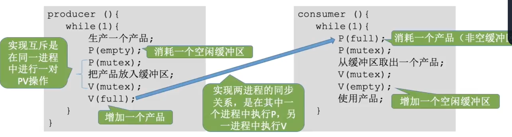

# 进程管理

## 进程与线程
### 进程的概念与特征
进程是进程实体的运行过程，是系统进行资源分配和调度的一个独立单位

PCB给操作系统用的<br>
程序段、数据段给进程自己用的<br>

特征: 动态性、并发性、独立性、异步性、结构性<br>
动态性是最基础的特性<br>

### 进程的状态与转换


进程PCB中会有一个`变量state`来表示进程当前状态

进程的转换:
<p align="center"></p>

进程的组织（大多是链式的）:
- 链接方式
  - 按照进程状态将PCB分为多个队列
  - 操作系统持有指向各个队列的指针
- 索引方式
  - 根据进程状态的不同，建立几张索引表
  - 操作系统持有指向各个索引表的指针

### 进程控制
进程的创建、终止、阻塞、唤醒的过程

#### 创建


#### 终止


#### 阻塞与唤醒


#### 切换


无论哪个进程控制原语，要做无非三件事：
1. 更新PCB中的信息
2. 将PCB插入合适的队列
3. 分配/回收资源

进程的控制为什么需要一气呵成？<br>
如果不能一气呵成就有可能导致操作系统中某些关键数据结构信息不统一的情况，这会影响操作系统进行别的管理工作<br>
怎么实现原语的原子性的？<br>
使用关中断和开中断这两个特权指令实现原子性<br>

### 进程通信
进程通信指的是进程间的信息交换
有共享存储、消息传递、管道通信三种通信方法
1. 共享存储
  - 设置一个共享内存区域，并映射到进程的虚拟地址空间
  - 要互斥地访问共享空间（由通信进程自己负责实现互斥）
  - 两种方式：
    - 基于数据结构（低级）
    - 基于存储区的共享（高级）
2. 消息传递
  - 传递结构化的消息（消息头/消息体）
  - 系统提供“发送/接受原语”
  - 两种方式：
    - 直接通信（直接发送消息到接收进程的消息队列里）
    - 间接（信箱）通信方式（消息先发到中间体，即信箱，另一个进程再从信箱里去数据）
3. 管道通信
  - 设置一个特殊的共享文件（管道），其实就是一个内存缓冲区
  - 一个管道只能实现伴双工通信 实现双向同时通信要建立两个管道
  - 各进程要互斥访问管道（由操作系统负责实现互斥）
  - 管道写满时，写进程阻塞。管道读空时，读进程阻塞

王道书中的错误：并不是只有管道数据满时，才能读取数据

### 线程的概念与特点
线程是进程的一部分<br>
传统进程机制中，进程是资源分配、调度的基本单位<br>
引入线程后，线程是`调度的基本单位`，进程是资源分配的基本单位<br>

传统机器只能进程间并发，引入线程后，各线程间也能并发<br>

传统的进程间并发需要切换进程运行环境，系统开销很大<br>
引入线程后，在同一进程中的线程切换，不需要切换进程运行环境，开销小<br>

线程的属性：
  - 多CPU计算机中，各个线程可占用不同的CPU
  - 每个线程都有一个线程ID，线程控制块（TCB）
  - 线程也有就绪、阻塞、运行三种基本状态
  - 线程几乎不拥有系统资源，同一进程的不同线程间共享进程的资源
  - 同一进程的线程通信无需操作系统干预

### 线程的实现方式和多线程模型


### 线程的状态与转换
TCB（线程控制块）大概有如下信息：
  - 线程标识符（TID，与PID类似）
  - 程序计数器PC（线程目前运行到哪）
  - 其他寄存器（线程运行的中间结果）
  - 堆栈指针（保存函数调用信息、局部变量等）
  - 线程运行状态（就绪、运行、阻塞）
  - 优先级（线程调度、资源分配的参考）
线程的组织就是使各种TCB根据不同系统来分门别类的组织起来
线程的控制就是各种状态之间的转换
<p align="center"></p>

**⚠️一些概念和错题知识点整理**<br>
- `创建`进程实质上是`创建进程映像中的PCB`；`撤销`进程实质上是`撤销进程的PCB`
- `进程映像`是静态的，`进程`是动态的
- 进程控制用的程序段称为`原语`，它是`不可分割`的基本单位
- 允许一个进程创建另一个进程，`创建者为父进程，被创建者为子进程`
- Block原语和Wakeup原语是一对作用刚好相反的原语，`必须成对使用`。Block是由被阻塞进程自我调用实现的，而Wakeup原语是一个与`被唤醒进程合作或被其他相关进程`调用实现的
- `进程切换`与`处理机模式切换`是不同的，`模式切换无须改变当前进程的环境信息`；`进程切换需要改变当前环境信息`
- `调度`是决定资源分配给哪个进程的行为，`是一种决策行为`；`切换`是实际分配的行为，是执行行为。一般来说`先有资源的调度，才有进程的切换`
- 并发进程失去`封闭性`是指并发进程共享变量，`其执行结果与速度有关`
- 一个计算机系统中，`进程最大数目`主要受`内存大小`限制

---

## 处理机调度
### 调度的概念
按照某种算法选择一个进程将处理机分配给他<br>
三层调度：作业调度、内存调度、进程调度<br>
<p align="center"></p>

补充知识：挂起状态<br>
<p align="center"></p>

### 调度的目标（调度算法的评价指标）
<p align="center"></p>
<br>
`系统吞吐量`=总共完成了多少道作业/总共花了多少时间<br>
`响应时间`=从用户提交请求到首次产生响应所用的时间

### 进程调度的时机、切换与过程、方式
什么时候需要调度？
- 主动放弃
  - 进程正常终止
  - 运行过程中发生异常而终止
  - 主动阻塞（如等待/O）
- 被动放弃
  - 分给进程的时间片用完
  - 有更紧急的事情需要处理（如/O中断）
  - 有更高优先级的进程进入就绪队列

什么时候不能进行调度？
- 在处理中断的过程中
- 进程在操作系统内核程序临界区中
- 原子操作过程中（原语）

切换与过程
- 狭义的`进程调度`只是从就绪队列`选中一个运行的进程`
- `进程切换`时指一个进程让出处理机，由另一个进程占用处理机的过程
- 广义的`进程调度`包含了`选中一个运行的进程`和`进程切换`两个步骤

进程切换的过程主要完成了：
- 对原来运行进程各种数据的保存
- 对新的进程各种数据的恢复

⚠️进程切换时有代价的，如果过于频繁的进行调度、切换，必然使整个系统效率降低<br>

进程调度有两种方式
1. 非剥夺调度方式（非抢占式）：只能由当前运行的进程主动放弃CPU
2. 剥夺调度方式（抢占式）：可由操作系统剥夺当前进程的CPU使用权

### 调度器/调度程序（schedule）
调度程序决定让谁运行和运行多长时间<br>
什么会出触发调度程序？<br>
- 创建新进程
- 进程退出
- 运行进程阻塞
- I/O中断发生（因为可能唤醒某些阻塞进程，即回到就绪态）
- 非抢占式调度策略，只有运行进程阻塞或退田才触发调度程序工作
- 抢占式调度策略，每个时钟中断或k个时钟中断会触发调度程序工作

**闲逛进程**（idle）<br>
- 优先级最低
- 可以是0地址指令，占一个完整的指令周期（指令周期末尾例行检查中断）
- 能耗低

【⚠️注意】
- 不支持内核级线程的操作系统，调度程序的处理对象是进程
- 支持内核级线程的操作系统，调度程序的处理对象是内核线程

### 调度算法
先来先服务（FCFS）
<p align="center"></p>
短作业优先（SJF）
<p align="center"></p>
最短剩余时间优先（SRTN） <del><em>即抢占式短作业优先</em></del>
<p align="center"></p>
高响应比优先（HRRN）<br>
响应比: (等待时间+要求服务时间)/要求服务时间<br>
<p align="center"></p>
适用于早期批处理系统的三种算法对比：<br>
<p align="center"></p>
时间片轮转（RR）
<p align="center"></p>
优先级调度（非抢占式）
<p align="center"></p>
优先级调度（抢占式）
<p align="center"></p>
多级反馈队列调度
<p align="center"></p>
交互式操作系统的三种算法对比：
<p align="center"></p>
多级队列调度算法，简单的例子：
<p align="center"></p>

**⚠️一些概念和错题知识点整理**<br>
- `UNIX`是一个强大的多用户、多任务操作系统、支持多种处理器架构，按照操作系统分类，属于`分时`操作系统
- `中断向量`本身是用于`存放中断服务例行程序的入口地址`

---

## 同步与互斥
### 同步与互斥的基本概念
为什么要引入同步互斥？<br>
因为并发进程是异步的，为了协调进程之间的相互制约关系，所以引入同步互斥<br>
同步：进程间协调工作，保证进程按预定的顺序执行<br>
互斥：进程间互斥访问共享资源，保证同一时刻只有一个进程访问共享资源<br>

四个部分：
- 进入区：检查是否可进入临界区，若可进入，需要`上锁`
- 临界区：访问临界资源的那段代码
- 退出区：负责`解锁`
- 剩余区：其余代码部分

需要遵循的原则：
- 空闲让进：临界区空闲时，应允许一个进程访问
- 忙则等待：临界区正在被访问时，其他试图访问的进程需要等待
- 有限等待：要在有限时间内进入临界区，保证不会饥饿
- 让权等待：进入不了临界区的进程，要释放处理机，防止忙等

### 进程互斥的软件实现方法
单标志法（使用turn表示允许进入临界区的进程号）
```c
int turn = 0;

// P0进程
while (turn != 0);
critical section;
turn = 1;
remainder section;

// P1进程
while (turn != 1);
critical section;
turn = 0;
remainder section;
```

双标志先检查法
<p align="center"></p>

双标志后检查法
<p align="center"></p>

Peterson算法<br>
主动争取；主动谦让；检查对方是否也想使用，且最后一次是不是自己谦让的
```c
int flag[2] = {0, 0};
int turn = 0;

// P0进程
flag[0] = 1;
turn = 1;
while (flag[1] == 1 && turn == 1);
critical section;
flag[0] = 0;
remainder section;

// P1进程
flag[1] = 1;
turn = 0;
while (flag[0] == 1 && turn == 0);
critical section;
flag[1] = 0;
remainder section;
```
总结：
<p align="center"></p>

### 进程互斥的硬件实现方法
中断屏蔽、TSL指令、Swap指令/XCHG指令
<p align="center"></p>

### 互斥锁
```C
acquire() {
  while(!available);
  available = false;
}
release() {
  available = true;
}
```
acquire或release执行必须是`原子操作`，因此采用`硬件机制实现`<br>
需要连续循环等的互斥锁都称为`自旋锁`（spin lock），如TSL指令、swap指令、单标志法<br>

特性：
- 需`忙等`，进程时间片用完才下处理机，违反“让权等待”
- 优点：等待期间不用切换进程上下文，多处理器系统中，若上锁的时间短，则等待代价很低
- `常用于多处理器系统`，一个核忙等，其他核照常工作，并快速释放临界区
- 不太适用于单处理机系统，忙等的过程中不可能解锁

### 信号量机制⭐️⭐️⭐️
一对原语：wait(S)和signal(S)，通常简称为P、V操作，因此可以写为P(S)、V(S)<br>
#### 整型信号量
用一个`整数型的变量`作为信号量，用来`表示系统中某种资源的数量`。
<p align="center"></p>

#### 记录型信号量
<p align="center"></p>

- P(S): 申请一个资源S，如果`资源不够就阻塞等待`
- V(S): 释放一个资源S，如果有进程在等待该资源，则`唤醒一个进程`

### 用信号量实现进程互斥、同步、前驱关系⭐️⭐️⭐️
#### 实现进程互斥
设置互斥信号量mutex，表示进入临界区的名额，初始值为1
- 临界区之前对mutex执行P操作，进入临界区
- 临界区之后对mutex执行V操作，释放临界区
<p align="center"></p>

#### 实现进程同步
设置同步信号量S，表示进程间同步的信号，初始值为0
- 在前操作之后对S执行V操作，表示前操作已经完成
- 在后操作之前对S执行P操作，表示后操作需要等待前操作完成
<p align="center"></p>
Eg：
<p align="center"></p>

### 经典同步问题⭐️⭐️⭐️
#### 生产者消费者问题
问题描述：
- 系统中有一组生产者进程和一组消费者进程
- 生产者进程每次生产一个产品放入缓冲区
- 消费者进程每次从缓冲区中取出一个产品并使用

缓冲区：生产者、消费者共享一个初始为空、大小为n的缓冲区<br>
同步关系：
1. 缓冲区没满时，生产者才能生产
2. 缓冲区不空时，消费者才能消费
互斥关系：缓冲区是临界资源，只能被一个进程访问

设置的信号量：
```c
semaphore mutex = 1; // 互斥信号量
semaphore full = 0; // 缓冲区中产品数
semaphore empty = n; // 缓冲区中空闲位置
```
根据关系画图：
<p align="center"></p>

代码实现：
<p align="center"></p>

不能将实现互斥的P操作放在对缓冲区的P操作之前，因为这样会导致`死锁`<br>
生产者执行P(mutex)变为0，由于没有空闲缓冲区（empty=0），因此生产者阻塞；再切换到消费者进程，由于mutex=0，因此消费者阻塞<br>

#### 多生产者多消费者问题
<p align="center"></p>
当plate这种资源为1时，可以不需要mutex这种信号量，因为三种同步信号量同一时刻最多只有一个的值为1<br>

#### 吸烟者问题
<p align="center"></p>
若一个生产者要生产多种产品（或者说会有多种前驱事件），那么各个V操作应该放在各自对应的“事件”发生之后<br>

#### 读者写者问题（比较复杂的互斥问题）
<p align="center"></p>
核心思想：设置了一个`计数器count`来记录当前正在访问的读进程数，我们可以用cout的值来判断当前进入的进程是否是第一个/最后一个读进程（加锁/解锁），从而做出不同的处理。另外，对count变量的检查和赋值不能一气呵成导致了错误（两个读者同时读的时候都满足count=0所以有一个读者被阻塞在rw这个互斥信号量），如果需要实现“一气呵成”，应该想到用互斥信号量<br>

#### 哲学家进餐问题
<p align="center"></p>
哲学家进餐问题关键在于解决死锁<br>
这些进程之间只存在互斥关系，但是与之前接触的互斥关系不同的是，每个进程都需要同时持有两个临界资源，因此就有发生循环等待的，产生死锁的隐患<br>

### 管程
信号量机制编写程序困难、易出错，因此引入了管程机制<br>
管程的组成（类似于class）：
- 局部于管程的`共享数据结构`说明
- 对该数据结构进行操作的`一组过程`
- 对局部于管程的共享数据设置初始值的语句
- 管程有一个名字

管程的一个实现：
<p align="center"></p>

1. 需要在管程中定义`共享数据`（如生产者消费者的缓冲区）
2. 需要再管程中定义用于访问共享数据的`入口`
3. 只有`通过这些特定的入口才能访问共享数据`
4. 每次`只能开放其中一个入口`，并且只能让一个进程或线程进入（`这种互斥特性是由编译器实现的`）
5. 可在管程中设置`条件变量`，及`等待/唤醒操作`以解决同步问题。可以让一个进程或线程在条件变量上等待（`此时，该进程应先释放管程的使用权，也就是让出入口`）

**⚠️一些概念和错题知识点整理**<br>
- 管程的signal操作和信号量机制的V操作区别是：管程中的signal操作只是有可能会唤醒一个进程，并不会使条件变量的值改变。且条件变量也是没有值的，不可以量化，只是起到一个队列作用；而V操作会使信号量的值+1
- `临界区`是指并发进程访问共享变量段的`代码`
- `公用队列`属于`临界资源`，需要互斥访问
- P、V操作是一种`低级进程通信原语`
- `共享程序段`必须用`可重入编码`（指一种能够被多个线程或多个程序实例同时安全地调用的代码）实现
- 并发编程中，`公共变量`需要`互斥`访问
- `缓冲区`是`临界资源`，隐藏条件是`互斥`
- `一读一写`或者`都为写`是`互斥`关系

## 死锁
### 死锁的概念
死锁：各进程互相等待对方手里的资源，导致各进程都阻塞，无法向前推进的现象<br>
死锁、饥饿、活锁、饥饿的区别：<br>
- 死锁：至少是两个进程一起死锁，死锁后进程一定是处于阻塞态
- 饥饿：可以只有一个进程饥饿，饥饿进程可能阻塞（长期得不到I/O设备），也可能就绪（长期得不到处理机）
- 死循环：可能只有一个进程发生死循环，死循环可以是运行态，由代码逻辑错误导致的
死锁和饥饿是操作系统的问题，死循环是被管理者的问题<br>

死锁的必要条件：
- 互斥条件：只有对互斥使用的资源的争抢才会导致死锁（像扬声器、内存这种可以多个进程同时使用的资源就不会导致死锁）
- 不可剥夺条件：进程所获得的资源在未使用完之前，不能被其他进程强行夺走，只能主动释放
- 请求和保持条件：进程因请求资源而阻塞时，对已获得的资源保持不放
- 循环等待条件：存在一种进程资源的循环等待链，链中每一个进程已获得的资源同时被下一个进程所请求
注意：发生死锁时一定有循环等待，但是发生循环等待时不一定发生死锁<br>

什么时候会发生死锁：
- 对系统资源的竞争
- 进程的推进顺序非法
- 信号量的使用不当也会导致死锁（如消费者生产者问题互斥的P操作在同步的P操作之前）
总之，对不可剥夺资源分配不合理，可能发生死锁<br>

死锁的处理策略：
- 预防死锁：破坏死锁的四个必要条件
- 避免死锁：在资源的动态分配中，防止系统进入不安全状态（银行家算法）
- 死锁的检测与解除：允许系统发生死锁，系统负责检测出死锁并解除

### 死锁的处理策略
#### 预防死锁

