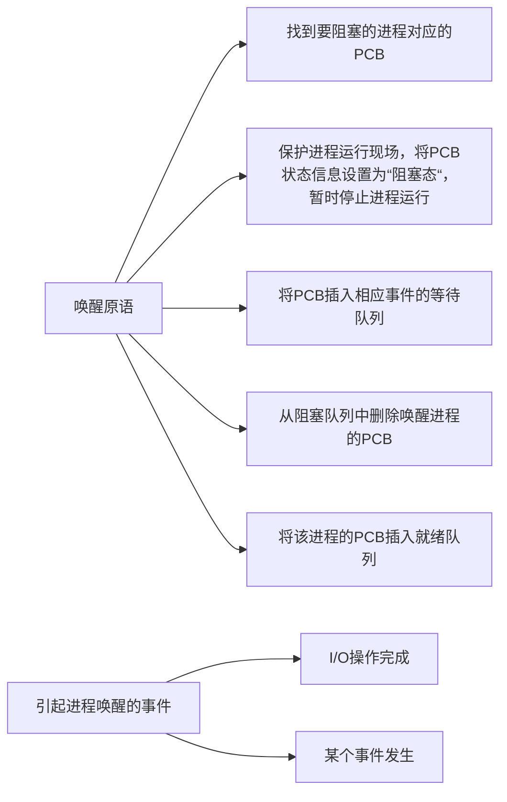

# 进程与线程

## 进程与线程
### 进程的概念与特征
进程是进程实体的运行过程，是系统进行资源分配和调度的一个独立单位

PCB给操作系统用的 
程序段、数据段给进程自己用的

特征: 动态性、并发性、独立性、异步性、结构性 
动态性是最基础的特性

### 进程的状态与转换

进程PCB中会有一个`变量state`来表示进程当前状态

进程的转换:

进程的组织（大多是链式的）:
- 链接方式
  - 按照进程状态将PCB分为多个队列
  - 操作系统持有指向各个队列的指针
- 索引方式
  - 根据进程状态的不同，建立几张索引表
  - 操作系统持有指向各个索引表的指针

### 进程控制
进程的创建、终止、阻塞、唤醒的过程

#### 创建

#### 终止

#### 阻塞与唤醒

进程的控制为什么需要一气呵成？
如果不能一气呵成就有可能导致操作系统中某些关键数据结构信息不统一的情况，这会影响操作系统进行别的管理工作
怎么实现原语的原子性的？
使用关中断和开中断这两个特权指令实现原子性
