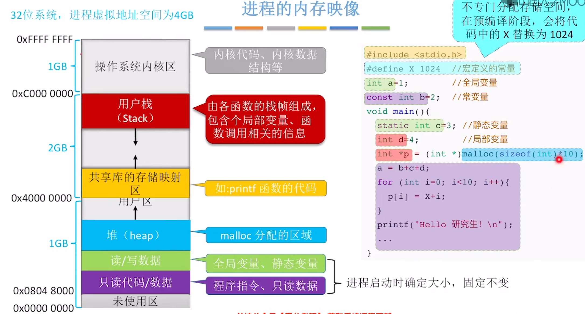
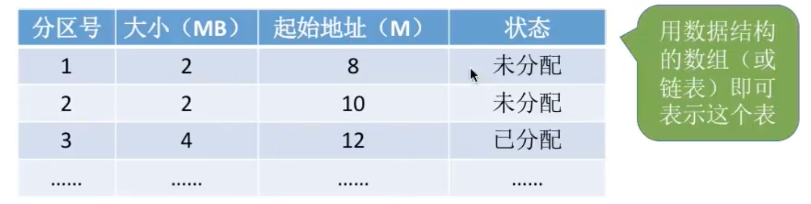
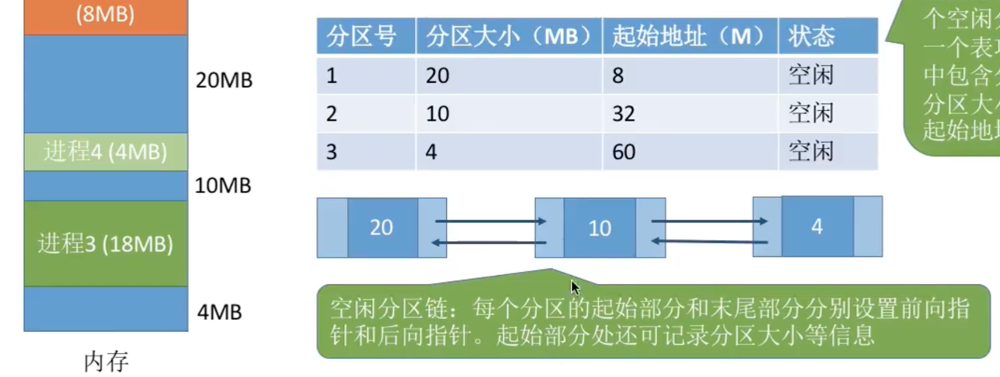

# 内存管理

## 内存管理概念
### 内存的基础知识
内存可存放数据（程序执行前需要先放到内存中才能被CPU处理，缓和CPU与硬盘之间的速度矛盾）<br>
从写程序到程序运行：
- 编译：由编译程序将用户源程序编译成若干个目标模块（就是将高级语言翻译成机器语言）
- 链接：由链接程序将编译后形成的一组目标模块，以及它们所需要的库函数链接在一起，形成一个完整的装入模块
- 装入：由装入程序将装入模块装入内存运行

装入的三种方式：
- 绝对装入：程序在编译时确定其在内存中的位置（只适用于单道程序环境，此时还没有操作系统）
- 静态重定位（可重定位装入）：编译、链接后的装入模块地址都是从0开始的，装入使对地址重定位，将逻辑地址变换为物理地址，装入后不能再移动，指令已经写死了具体要操作的物理地址（用于早期多道批处理系统）
- 动态重定位（动态运行时装入）：装入程序把程序装入内存后，并不会立即把逻辑地址转换为物理地址，而是把地址装换推迟到程序真正执行时才进行，因此装入内存后所有地址依然是逻辑地址，此方式需要一个重定位寄存器支持，允许程序在内存中发生移动

链接的三种方式：
- 静态链接：在程序运行之前，先将各目标模块及它们所需的库函数连接成一个完整的可执行文件
- 装入时动态链接：将各目标模块装入内存时，边装入边链接的链接方式
- 运行时动态链接：运行时对需要的目标模块进行装入、链接

### 内存管理
管理些什么？
1. 内存空间的分配与回收
2. 对内存空间的扩充（虚拟存储技术）
3. 地址转换（用三种装入方式）
4. 存储保护
  - 方法一：设置一对上、下限寄存器，分别存放内存的上下限地址，当程序要访问内存时，由CPU检查内存地址是否越界
  - 方法二：采用重定位寄存器（又称基址寄存器）和界地址寄存器（又称限长寄存器）进行越界检查。重定位寄存器中存放的是进程的起始物理地址，界地址寄存器中存放的是进程的最大逻辑地址，当程序要访问内存时，CPU将逻辑地址与界地址寄存器比较，若逻辑地址大于界地址寄存器，则产生越界，若逻辑地址小于重定位寄存器，则将逻辑地址加上重定位寄存器的值，得到物理地址

### 进程的内存映像
<p align="center"></p>
```c
#define X 1024//宏定义常量是立即数，编译时直接替换
const int b = 2;//常变量 放在只读代码/数据段
int a = 1;//全局变量 放在读/写数据段
void main() {
  static int c = 3;//静态变量 放在读/写数据段
}
```

### 内存空间的分配与回收
#### 连续分配管理方式
单一连续分配：
- 只支持`单道程序`，内存分为系统区和用户区，用户程序放在用户区
- `无外部碎片，但有内部碎片`

固定分区分配：
- 支持多道程序，内存用户空间分为若干个固定大小的分区，每个分区只能装一道作业
- `无外部碎片，但有内部碎片`
- 两种分区方式：
  - 分区大小相等
  - 分区大小不等

操作系统需建立一个`分区说明表`来表示各个分区的分配情况
<p align="center"></p>

动态分区分配：
- 支持多道程序，在进程装入内存时，根据进程的大小动态地建立分区
- `无内部碎片，有外部碎片`
- 外部碎片可通过`紧凑技术`解决
- `回收分区`（总结就是回收空闲分区后，如果发现有一些空闲分区是相邻的，就需要合并）时，有四种情况：
  - 回收区之后有相邻的空闲分区
  - 回收区之前有相邻的空闲分区
  - 回收区前、后有相邻的空闲分区
  - 回收区前、后没有相邻的空闲分区

操作系统使用空闲分区表或空闲分区链来管理空闲分区
<p align="center"></p>

#### 动态分区分配算法
在动态分区分配方式中，当很多空闲分区都能够满足需求时，应该选择哪个？<br>
1. 首次适应算法（FF）：空闲分区以地址递增的次序链接。分配内存时顺序查找，找到大小能满足要求的第一个空闲分区
