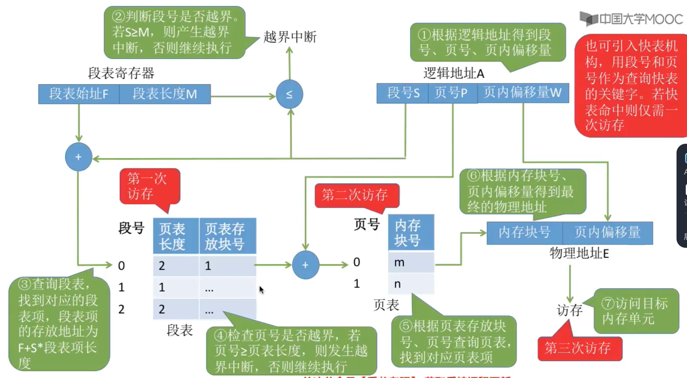

# 内存管理

## 内存管理概念
### 内存的基础知识
内存可存放数据（程序执行前需要先放到内存中才能被CPU处理，缓和CPU与硬盘之间的速度矛盾）<br>
从写程序到程序运行：
- 编译：由编译程序将用户源程序编译成若干个目标模块（就是将高级语言翻译成机器语言）
- 链接：由链接程序将编译后形成的一组目标模块，以及它们所需要的库函数链接在一起，形成一个完整的装入模块
- 装入：由装入程序将装入模块装入内存运行

装入的三种方式：
- 绝对装入：程序在编译时确定其在内存中的位置（只适用于单道程序环境，此时还没有操作系统）
- 静态重定位（可重定位装入）：编译、链接后的装入模块地址都是从0开始的，装入使对地址重定位，将逻辑地址变换为物理地址，装入后不能再移动，指令已经写死了具体要操作的物理地址（用于早期多道批处理系统）
- 动态重定位（动态运行时装入）：装入程序把程序装入内存后，并不会立即把逻辑地址转换为物理地址，而是把地址装换推迟到程序真正执行时才进行，因此装入内存后所有地址依然是逻辑地址，此方式需要一个重定位寄存器支持，允许程序在内存中发生移动

链接的三种方式：
- 静态链接：在程序运行之前，先将各目标模块及它们所需的库函数连接成一个完整的可执行文件
- 装入时动态链接：将各目标模块装入内存时，边装入边链接的链接方式
- 运行时动态链接：运行时对需要的目标模块进行装入、链接

### 内存管理
管理些什么？
1. 内存空间的分配与回收
2. 对内存空间的扩充（虚拟存储技术）
3. 地址转换（用三种装入方式）
4. 存储保护
  - 方法一：设置一对上、下限寄存器，分别存放内存的上下限地址，当程序要访问内存时，由CPU检查内存地址是否越界
  - 方法二：采用重定位寄存器（又称基址寄存器）和界地址寄存器（又称限长寄存器）进行越界检查。重定位寄存器中存放的是进程的起始物理地址，界地址寄存器中存放的是进程的最大逻辑地址，当程序要访问内存时，CPU将逻辑地址与界地址寄存器比较，若逻辑地址大于界地址寄存器，则产生越界，若逻辑地址小于重定位寄存器，则将逻辑地址加上重定位寄存器的值，得到物理地址

### 进程的内存映像
<p align="center"></p>
```c
#define X 1024//宏定义常量是立即数，编译时直接替换
const int b = 2;//常变量 放在只读代码/数据段
int a = 1;//全局变量 放在读/写数据段
void main() {
  static int c = 3;//静态变量 放在读/写数据段
}
```

### 内存空间的分配与回收
#### 连续分配管理方式
单一连续分配：
- 只支持`单道程序`，内存分为系统区和用户区，用户程序放在用户区
- `无外部碎片，但有内部碎片`

固定分区分配：
- 支持多道程序，内存用户空间分为若干个固定大小的分区，每个分区只能装一道作业
- `无外部碎片，但有内部碎片`
- 两种分区方式：
  - 分区大小相等
  - 分区大小不等

操作系统需建立一个`分区说明表`来表示各个分区的分配情况
<p align="center"></p>

动态分区分配：
- 支持多道程序，在进程装入内存时，根据进程的大小动态地建立分区
- `无内部碎片，有外部碎片`
- 外部碎片可通过`紧凑技术`解决
- `回收分区`（总结就是回收空闲分区后，如果发现有一些空闲分区是相邻的，就需要合并）时，有四种情况：
  - 回收区之后有相邻的空闲分区
  - 回收区之前有相邻的空闲分区
  - 回收区前、后有相邻的空闲分区
  - 回收区前、后没有相邻的空闲分区

操作系统使用`空闲分区表`或`空闲分区链`来管理空闲分区
<p align="center"></p>

#### 动态分区分配算法
在动态分区分配方式中，当很多空闲分区都能够满足需求时，应该选择哪个？<br>
1. 首次适应算法（FF）：空闲分区以地址递增的次序链接。分配内存时顺序查找，找到大小能满足要求的第一个空闲分区链（或空闲分区表）
2. 最佳适应算法（BF）：空闲分区`按容量递增次序链接`，找到第一个能满足要求的空闲分区链（或空闲分区表）
3. 最坏适应算法（WF）：又称最大适应算法（Largest Fit），空闲分区`按容量递减次序链接`，找到第一个能满足要求的空闲分区链（或空闲分区表）
4. 邻近适应算法（NF）：空闲分区以地址递增的顺序排列（可排成一个循环链表）。每次分配内存时从上次查找结束的位置开始查找空闲分区链（或空闲分区表），找到大小能满足要求的第一个空闲分区。
<p align="center"></p>

#### 非连续分配管理方式
##### 基本分页存储管理的基本概念
什么是分页存储？<br>
将内存空间分为一个个大小相等的分区（比如每个分区4KB），每个分区就是一个`页框`<br>
`页框`=`页帧`=`内存块`=`物理块`=`物理页面`，页框号从0开始<br>
而`页`或`页面`指进程的逻辑地址空间也分为与页框大小相等的一个个的部分，页号也是从0开始的<br>
操作系统以`页框`为单位为各个进程分配内存空间，`进页面与页框有一一对应的关系`<br>

重要的数据结构：**页表**<br>
为了能知道进程的每个页面在内存中存放的位置，操作系统要为每个进程建立一张`页表`，`页表存储在主存中`<br>
1. 一个进程对应一张页表
2. 进程的每个页面对应一个页表项
3. 每个`页表项`由“页号”和“块号”组成
4. 页表记录进程`页面`和实际存放的`内存块`之间的`映射关系`

每个页表项占多少字节？<br>
与我们想象的不同，虽然页表包含了页号和块号，但是只需要存储块号就行了，页号本身就是从0-n的顺序索引，并不需要额外花费存储空间<br>
<p align="center"></p>

**逻辑地址结构**：`页号(P) + 页内偏移(W)`⭐️⭐️⭐️<br>
页号 = `逻辑地址` / `页面大小`<br>
页内偏移 = `逻辑地址` % `页面大小`<br>

Eg: 由逻辑地址推理页号和页内偏移？<br>
<p align="center"></p>

如何实现地址的转换？<br>
1. 计算逻辑地址的页号和页内偏移
2. 用页号查页表，找到对应的块号，计算出页面在内存中的存放位置
3. 物理地址 = 页面起始地址 + 页内偏移

##### 基本地址变换机构
页表寄存器的作用：存放页表`在内存中的起始地址`和`页表长度`<br>
地址变换过程：⭐️⭐️⭐️
1. 根据逻辑地址算出页号、页内偏移量
2. 页号的合法性检查（与页表长度对比）
3. 若页号合法，再根据页表起始地址、页号找到对应页表项（`页表项地址`=`页表起始地址`+`页号`*`页表项长度`）
4. 根据页表项中记录的内存块号、页内偏移量得到最终的物理地址
5. 访问物理内存对应的内存单元
<br>【注意】：`页表长度`指的是这个页表中总共有多少个页表项，`页表项长度`指的是每个页表项占多大存储空间，`页面大小`指的是一个页面占多大存储空间<br>

Eg:⭐️⭐️⭐️
<p align="center"></p>
注意：`页内偏移量和页面大小的关系`和`页式管理中地址是一维的`

##### 具有快表的地址变换机构
快表，又称联想寄存器（TLB），是一种访问速度比内存快很多的告诉缓存，用来存放最近访问的页表项的副本，可以加速地址变换的速度，内存中的页表称为慢表<br>
1. CPU给出逻辑地址，由某个硬件算得页号、页内偏移量，将页号与快表中的所有页号进行比较。
2. 如果找到，直接从快表中取出对应的块号，与页内偏移量拼接得到物理地址，然后访问内存。因此快表命中只需要一次访存。
3. 如果没有找到，需要访问内存中的页表，找到对应页表项，得到页面存放的内存块号，与页内偏移量拼接得到物理地址，然后访问内存。因此快表未命中需要两次访存。（找到页表项后，同时将其放入快表）<br>
两种机制：`先快表查找，找不到再慢表查找`；`快表慢表同时找`<br>
<p align="center"></p>
- 空间局部性：如果程序中的某条指令一旦执行，不久以后该指令可能再次执行；如果某数据被访问过，不久以后该数据可能再次被访问。产生时间局部性的典型原因，是由于在程序中存在着大量的循环操作。
- 时间局部性：一旦程序访问了某个存储单元，在不久之后，其附近的存储单元也将被访问，即程序在一段时间内所访问的地址，可能集中在一定的范围之内，这是因为指令通常是顺序存放、顺序执行的，数据也一般是以向量、数组、表等形式簇聚存储的。

##### 两级页表（套娃）
单级页表存在的问题：所有页表项必须连续存放，页表过大时需要很大的连续空间<br>
逻辑地址结构：（一级页号，二级页号，页内偏移量）<br>
`页目录表/外层页表/顶级页表`都是指为离散的页表再建立的页表<br>

还有一个问题：没有必要让整个页表常驻内存，因为进程在一段时间内可能只需要访问某几个特定的页面
可以在需要访问的时候才把页面调入内存（虚拟存储技术），可以在页表项中增加一个标志位，用于表示该页面是否已调入内存，若访问的页面不在内存中，则产生缺页中断<br>

多级页表中，各级页表的大小不能超过一个页面，若两级页表不够，可以分更多级<br>
假设多没有快表机构，N级页表访问一个逻辑地址需要N+1次访存<br>
<p align="center"></p>

##### 基本分段存储管理
<p align="center"></p>

1. 每一个段对应一个段表项，由段号（隐含）、段长、基址组成
2. 程序员编程时需要`显式的给出段号和段内地址`（分段是可见的而分页是不可见的）
3. 分段管理会产生外部碎片，分页管理不会产生外部碎片
4. 在地址变换过程中与分页式存储管理唯一不同的是需要根据段长来判断段内地址是否越界，如下：<br>
<p align="center"></p>
<p align="center"></p>

##### 段页式管理
<p align="center"></p>

段页式管理的逻辑地址结构：
<p align="center"></p>

地址变换：
<p align="center"></p>

---

## 虚拟内存管理
### 虚拟内存的基本概念
传统存储管理方式存在的问题：
- 一次性：作业必须一次性全部装入内存后才能开始运行
- 驻留性：作业装入内存后，便一直驻留在内存中，直至作业运行结束

虚拟内存的特征：
- 多次性：一个作业可以分多次调入内存运行
- 对换性：作业运行过程中，可以将暂时不用的程序和数据换出到外存上，待需要时再换入内存
- 虚拟性：从逻辑上扩充内存的容量，使用户看到的内存容量，远大于实际内存容量

虚拟内存的实现：`请求分页管理方式`、`请求分段管理方式`、`请求段页式管理方式`<br>

### 请求分页管理方式
增加了状态位、访问字段、修改位、外存地址<br>
<p align="center"></p>
当访问的`页面不在内存`时，便会产生一个`缺页中断`，然后由操作系统的缺页中断处理程序处理中断<br>
此时缺页的进程阻塞，放入阻塞队列，调页完成后再将其唤醒，放回就绪队列<br>
如果内存有空闲块，则分配一个空闲块，并修改页表中的页表项<br>
如果内存中没有空闲块，则由页面置换算法选择一个页面淘汰，若该页面在内存期间被修改过，还要将其写回外存<br>

**缺页中断机构**
`缺页中断`因指令执行而产生，属于`内中断`；而`一条指令可能产生多次缺页中断`<br>
又因为缺页中断是能够解决非有意为之的中断所以属于故障（fault）<br>
（能解决有意为之的是陷入；不能解决的终止，如整数除以0）<br>

**地址变换机构**
与基本分页不同点：
1. 只有`写指令`才需要修改`修改位`
2. 中断处理保留现场，然后需要调页
3. 如果内存满了，需要做页面置换
4. 换入换出需要启动慢速I/O操作
5. 页面调入内存，需要修改慢表，将表项复制到快表
<p align="center"></p>

### 页面置换算法
1. 最佳置换算法（OPT，optimal）：置换将来最长时间内不再被访问的页面，需要预知未来，实际应用无法实现
<p align="center"></p>

2. 先进先出置换算法（FIFO）：置换最先进入内存的页面，但是会有Belady异常，即为当前进程分配的物理块数增加，缺页率反而升高，所以算法虽然简单，但是性能最差
<p align="center"></p>

3. 最近最久未使用置换算法（LRU，Least Recently Used）：置换最近最久未使用的页面，用页表项中的`访问字段`记录该页面自上次被访问以来所经历的时间T，需要硬件支持，开销大，但是性能最接近OPT
<p align="center"></p>

4. 时钟置换算法（Clock）：又称最近未使用置换算法，是一种性能和开销较均衡的算法
简单的时钟置换算法：每个页面设置一个访问位，最近被访问过设为1，最近没有被访问过设为0，最多会进行两轮扫描（没有考虑页面是否被修改过）
<p align="center"></p>
改进型时钟置换算法：用（访问位，修改位）表示各页面状态，最多进行四轮扫描
<p align="center"></p>

### 页面分配策略
几个概念：
- 驻留集：进程运行时驻留在内存中的页面集合
- 固定分配：驻留集大小在进程运行期间再改变
- 可变分配：驻留集大小可以动态改变
- 局部置换：发生缺页时只能选进程自己的页面进行置换
- 全局置换：发生缺页时，操作系统可以将空闲物理块分配给缺页进程，也可以将别的进程持有的物理块置换到外存，再分配给缺页进程

三种页面分配策略：
<p align="center"></p>

何时调入页面：
- 预调页策略：一次调入若干相邻页面。但预测成功率只有50%，故主要用于进程的首次调入，由程序员指出应该先调入哪些部分
- 请求调页策略：进程子啊运行期间发现缺页时才将缺页调入内存。I/O开销大。

从何处调页：
- 对换区：采用连续存储方式，速度快；文件区：采用离散存储方式，速度慢
- 对换区足够大：将数据从文件区调入对换区，之后所有页面调入、调出都在内存与对换区间进行
- 对换区不够大：不会修改的数据每次都从文件区调入；会修改的数据调出到对换区，需要时再从对换区调入
- UNIX方式：第一次使用的页面都从文件区调入，调出的页面都放入对换区，再次使用时从对换区调入

抖动现象：频繁的换入换出现象，主要因为进程分配到的物理块不够<br>

工作集：某段时间间隔，进程实际访问的页面的集合。一般驻留集不小于工作集<br>

### 内存映射文件（Memory-Mapped Files）
<p align="center"></p>
传统方式太麻烦了，所以引入了内存映射文件，将文件直接映射到虚拟地址中，程序员只需要以访问内存的方式读写文件，文件的数据的读入写出由操作系统自动完成<br>
同时，多个进程可以映射同一个文件，方便共享<br>
优点：
- 程序员编程方便，已建立映射的文件可以像内存一样访问
- 文件的数据的读入写出由操作系统自动完成，I/O效率可以由操作系统负责优化
