# 文件管理

## 初识文件管理
本章节大概内容：

## 文件的逻辑结构
根据有无结构，文件可分为无结构文件和有结构文件 
无结构文件：文件内部的数据由一系列二进制流或字符流组成，又称`流式文件`（如.txt文件） 
有结构文件：由一组相似的记录组成，又称“记录式文件”。每条记录又若干个数据项组成。如： 数据库表文件。一般来说，每条记录有一个数据项可作为`关键字`。根据各条记录的长度（占用的存储空间）是否相等，又可分为`定长记录和可变长记录`两种。 

顺序文件：一般指顺序存储的文件

索引文件：指的是索引表，是定长记录的顺序文件，按关键字索引的话，可以快速检索记录

索引顺序文件：将记录分组，每组对应一个索引表项，检索记录时先顺序查索引表，找到分组，再顺序查找分组。当记录过多时，可建立多级索引表（会计算查找次数）

## 文件目录
目录文件是一种特殊的文件 
一个文件对应一个`FCB（文件控制块）`，一个FCB就是一个目录项，由FCB的集合组成了文件目录 
对目录的操作：搜索、创建文件、删除文件、显式文件、修改文件 

目录结构：
- 单级目录结构：一个系统只有一张目录表，不允许文件重名
- 两级目录结构：一个系统有两张目录表，不同用户的文件可以重名，但不能对文件进行分类（因为所有文件都在第二级目录）
- 多级（树形）目录结构：
  - 不同目录下的文件可以重名，可以对文件进行分类，不方便文件共享
  - 系统根据文件路径找到目标文件
  - 从根目录出发路径是绝对路径；从当前目录出发的路径是相对路径（可以减少磁盘I/O）
- 无环图目录结构：
  - 在树形目录的基础上，增加一些指向同一节点的有向边
  - 为共享节点设置一个共享计数器，当共享计数器为0时，才真正删除该节点

索引结点：除文件名外，所有信息都放在索引结点；目录项中只包含文件名、索引结点指针，因此每个目录项的长度大幅减小，可以使每个磁盘块存放更多的目录项，从而检索文件磁盘I/O次数减少

## 文件的物理结构（文件的分配方式）
操作系统为文件分配存储空间都是以块为单位的 

连续分配：要求每个文件在磁盘上占有一组连续的块 
- 优点：`支持顺序访问和直接访问`（随机访问），这种方式随机访问时是最快的
- 缺点：不方便文件拓展，存储空间利用率低，会产生磁盘碎片

⚠️考试中默认链接分配是隐式的
隐式链接分配：除文件最后一个盘块外，每个盘块中都存有指向下一个盘块的指针。文件目录记录了第一块指针和最后一块指针
- 优点：方便文件拓展，存储空间利用率高，不会产生磁盘碎片
- 缺点：`不支持随机访问`，只能顺序访问（读入i号逻辑块需要i+1次磁盘I/O），查找效率低，指向下一个盘块的指针占用了存储空间

显式链接分配：磁盘中的所有块的指针都显式的存放在一张表中（文件分配表，FAT）
FAT：一个磁盘仅有一张FAT，开机时，将FAT读入内存，并常驻内存。因为表项在物理上连续存储，且长度一样，所以`物理块号`可以是`隐含的`

优点：很方便文件拓展，不会有碎片，外存利用率高，`支持随机访问`，相比于隐式链接，`地址转换不需要访问磁盘，因此文件访问效率更高`
缺点：文件分配表会占用一定存储空间

索引分配：文件离散的分配在各个磁盘块中，系统会`为每个文件建立一张索引表`，索引表中`记录了文件各逻辑块对应的物理块`，索引表存放的磁盘块称为`索引块`。文件数据存放的磁盘块称为`数据块`
假设一个磁盘块1KB，一个索引表项4B，则一个磁盘块能存256个索引项，但是一个文件的大小超过256块，一个磁盘块就装不下一张索引表了，三种解决方式：
1. 链接方案：可以将多个索引块链接起来
缺点：想要找到i号索引块，必须先依次读入0~i-1号索引块，查找效率低

2. 多层索引：建立多层索引（类似于多级页表），采用`K层索引`，`且顶级索引表未调入内存`，则访问一个数据块`只需K+1次磁盘I/O`
缺点：即使小文件，访问一个数据块依然需要K+1次磁盘I/O

3. 混合索引：多种索引分配方式结合（顶级索引表中包好直接地址、一级间接地址、二级间接地址）

⭐️⭐️⭐️会计算文件的最大长度，会分析访问某个块需要的读磁盘次数⭐️⭐️⭐️

## 文件存储空间的管理
存储空间的划分：将物理磁盘划分为一个个文件卷（逻辑卷、逻辑盘） 
存储空间的初始化：将各个文件卷划分为目录区、文件区 
目录区主要存放目录信息、用于磁盘空间管理的信息，文件区主要存放文件数据 

文件存储空间的管理：`空闲表法`、`空闲链表法`、`位示图法`、`成组链接法` 
空闲表法：使用`空间盘块表`记录空闲盘块

空闲链表法：
- 空闲盘块链：以盘块为单位组成一条空闲链
- 空闲盘区链：以盘区为单位组成一条空闲链

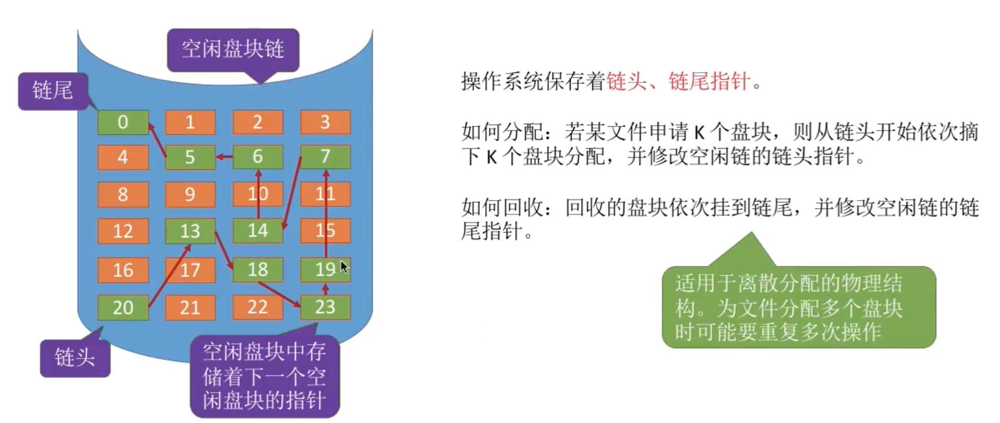

位示图法：每个二进制位对应一个盘块，可以用0表示空闲，1表示占用
⭐️⭐️⭐️盘块号和（字号，位号）的转换⭐️⭐️⭐️

如何分配，需要K个块？ 
1. 顺序扫描位示图，找到K个相邻或不相邻的“0”
2. 根据字号、位号算出对应的盘块号，将相应盘块分配给文件
3. 将相应位设置为“1”
如何回收？ 
1. 根据回收的盘块号计算出对应的字号、位号
2. 将相应位设置为“0”

成组链接法：文件卷的`目录区`中专门用一个磁盘块作为`超级块`，系统启动时需要将超级块读入内存，并且要保证数据一致（UNIX采用的策略适用于大型文件系统） 
- 超级块永远指向第一个分组
- 在超级块和每一个分组的第一个块中需要记录下一个分组空闲盘块的信息
- 一个分组中的块号不需要连续
- 若已经没有下一个空闲块，可以将记录值设为特殊值（-1） 
如何分配？ 

如何回收？ 

## 文件的基本操作
创建文件：分配外存空间，创建目录项 
删除文件：回收外存空间，删除目录项 
打开文件：
- 将目录项中的信息复制到内存中的打开文件表中，并将表的索引号（文件描述符）返回给用户
- 打开文件后，对文件操作不需要再查询目录，可以根据内存中的打开文件表快速定位到文件
- 每个进程有自己的打开文件表，系统中有一张总的打开文件表
- 进程打开文件表中特有的属性：读写指针、访问权限（只读？读写？）
- 系统打开文件表中特有的属性：打开计数器（有多少个进程打开了该文件）

关闭文件：将内存中的打开文件表项删除，将系统打开文件表中打开计数器减1，当打开计数器为0时，删除表项 

读文件：根据读指针、读入数据量、内存位置，将文件数据从外存读入内存 
写文件：根据写指针、写入数据量、内存位置，将文件数据从内存写到外存 

## 文件共享
硬链接：
- 各个用户的目录项指向同一个索引结点
- 索引结点中需要有链接计数count
- 某用户想删除文件时，只是删除该用户的目录项，count--
- 当count为0时，才真正删除文件数据和索引结点，否则导致指针悬空 
软链接（符号链接）：
- 在一个Link型的文件中记录共享文件的存放路径
- 操作系统根据路径一层层查找目录，最终找到共享文件
- 即使软链接指向的共享文件被删除，软链接依然存在，因为软链接指向的是路径，而不是文件本身，只是查找共享文件会失败<
- 由于软链接的方式访问共享文件要查询多级目录，会有多次磁盘I/O，因此效率低 

## 文件保护
- 口令保护：为文件设置一个口令，用户想要访问文件需要提供口令，开销小，但是口令一般存放在FCB或索引节点中，因此不太安全
- 加密保护：用一个密码对文件加密，需提供相同的密码才能解密，安全性高，但是加密解密需要耗费一定时间（异或加密）
- 访问控制：用一个访问控制表（ACL）记录每个用户的访问权限，文件访问类型可以分为读、写、执行、删除等 

## 文件系统的层次结构

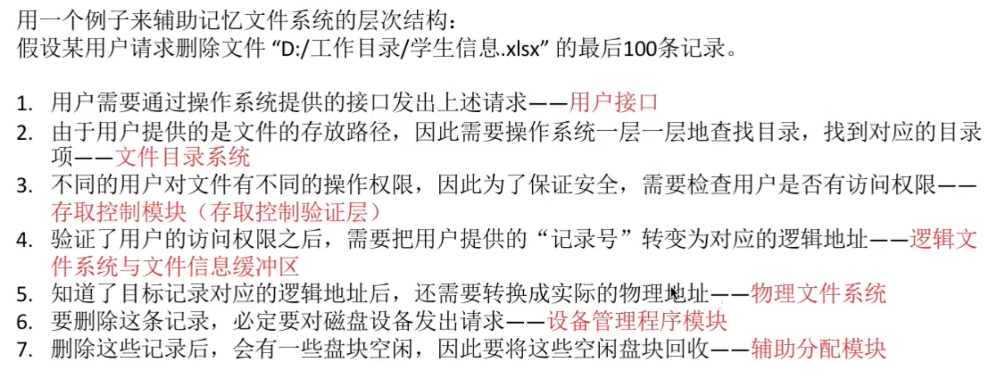

## 文件的系统布局（新考点）
文件系统在磁盘中的结构： 
初始磁盘没有任何扇区，生产后会`物理格式化`（即低级格式化），划分扇区，检测坏扇区，并用备用扇区替换坏扇区 
逻辑格式化后就有了磁盘分区（分卷Volume），灰色部分有了实际数据，白色部分还没有：

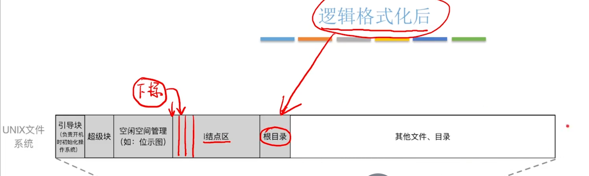

其中i结点区记录所有文件的索引结点，超级块和空闲空间管理上面学过 

文件系统在内存中的结构： 
分为目录的缓存（即近期打开的目录会缓存在内存中）、系统打开文件表和目录打开文件表 
打开文件和读文件的例子： 

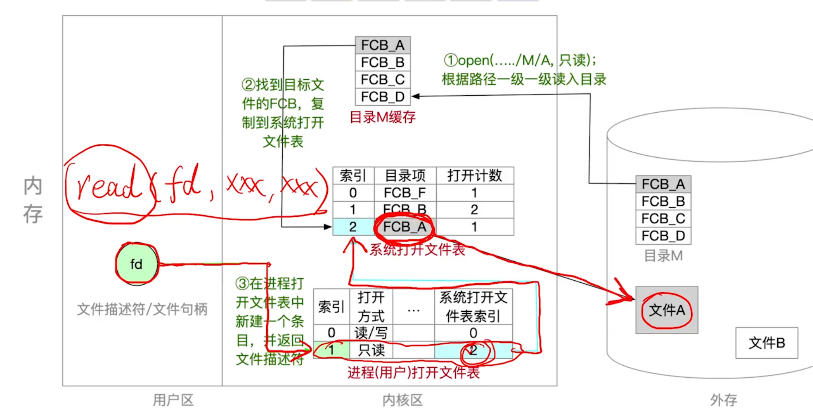

## 虚拟文件系统和文件系统的挂载
虚拟文件系统的特点：
1. 向上层用户进程提供统一标准的系统调用接口，屏蔽底层具体文件系统的实现差异
2. VFS要求下层的文件系统必须实现某些规定的函数功能，如：open/read/write。一个新的文件系统想要在某操作系统上被使用，就必须满足该操作系统VFS的要求 

虚拟文件系统存在的问题：不同文件系统的文件数据结构各不相同，其在内存中的表示不同
所以虚拟文件系统的特点3：
3. 每打开一个文件，VFS就在内存中新建一个`vnode`，用统一的数据结构表示文件，无论该文件存储在哪个文件系统，除了文件的基本信息外，vnode还具有函数功能指针指向具体文件系统的函数功能

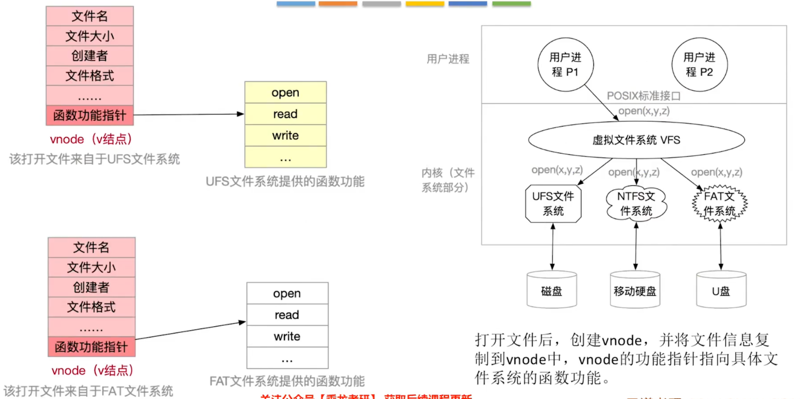

如何将文件系统挂载到操作系统中？ 
1. 在VFS中注册新挂载的文件系统。`内存中的挂载表`（mount table）包含了文件系统相关信息，包括文件系统类型、容量大小
2. 挂载的文件系统要向VFS提供一个函数地址列表
3. 将新文件系统加到挂载点，也就是将新文件系统挂载到某个父目录下

## 磁盘的结构

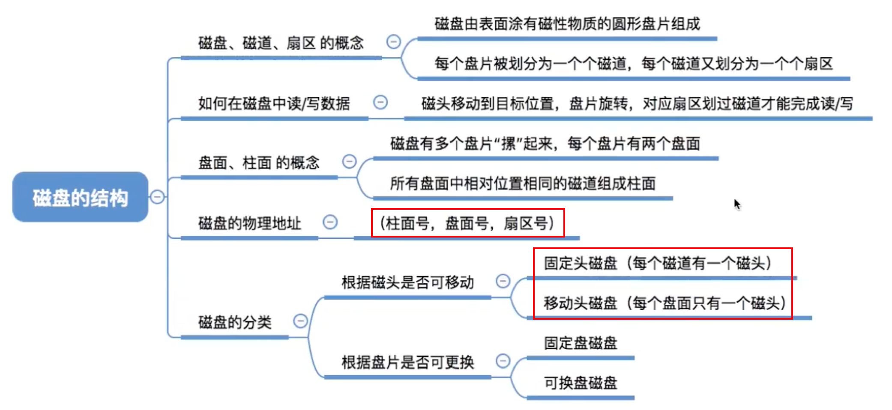

## 磁盘调度算法
一次读磁盘/写操作需要的时间=`寻道时间`+`延迟时间`+`传输时间`

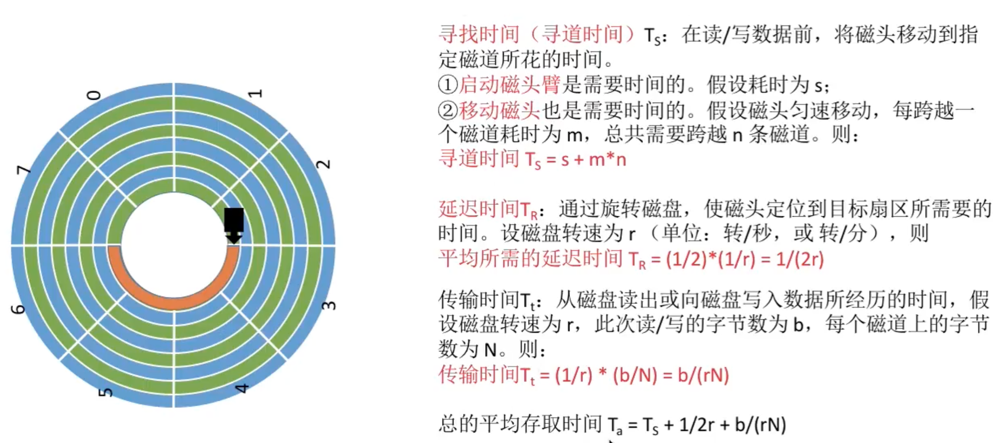

磁盘调度算法（寻道时间）：
- 先来先服务（FCFS）：按照请求顺序进行调度

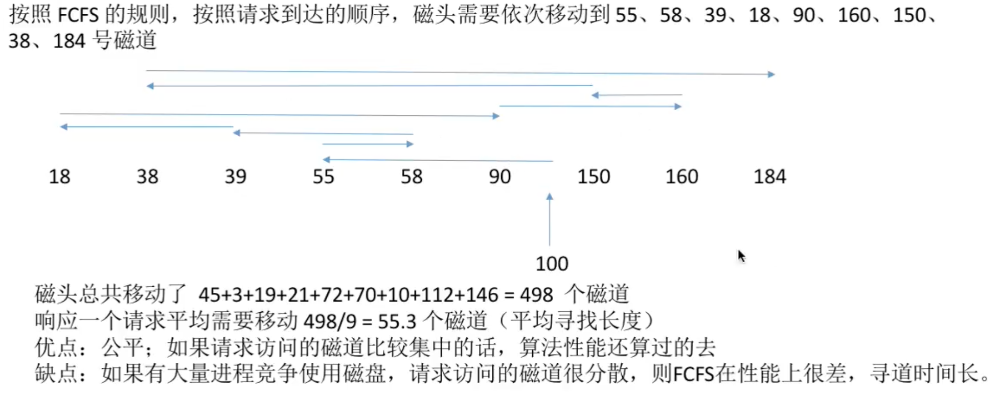

- 最短寻道时间优先（SSTF）：优先调度离当前磁头最近的磁道（缺点：可能导致饥饿）

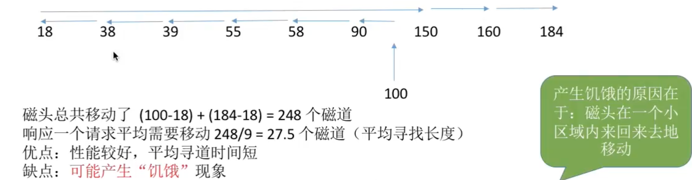

- 扫描算法（SCAN，电梯算法）：只有磁头移动到最外侧磁道的时候才能往内移动，移动到最内侧磁道的时候才能往外移动（缺点：各个位置磁道的响应频率不平均）

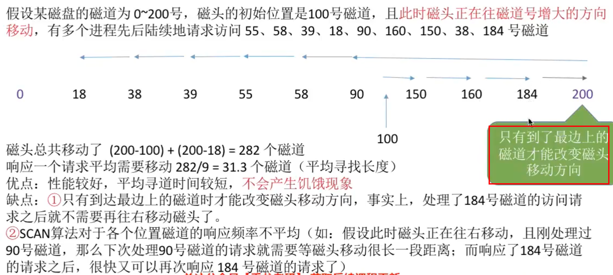

- 循环扫描算法（C-SCAN）：只有磁头朝某个方向移动时才会响应请求，移动到边缘后立即让磁头返回起点，返回途中不响应任何请求

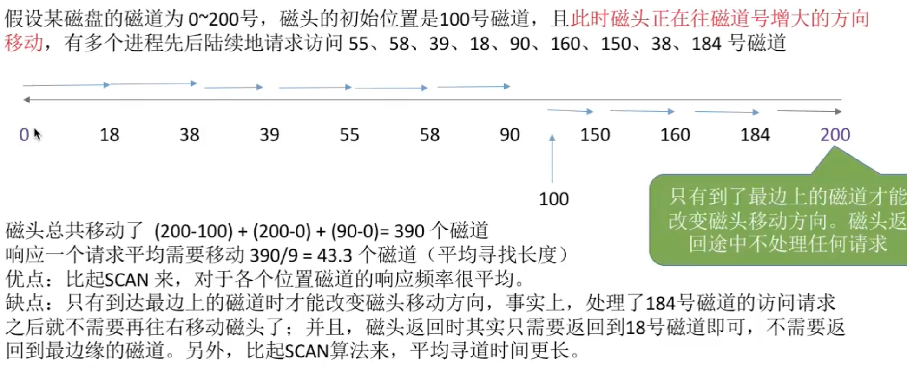

- 低频考点：
  - LOOK算法：SCAN算法的改进，只要在磁头移动方向上不再有请求，就立即改变磁头方向
  - C-LOOK算法：C-SCAN算法的改进，只要在磁头移动方向上不再有请求，就立即让磁头返回

## 减少磁盘延时时间方法
原理：磁头读入一个扇区数据后需要一小段时间处理， 如果逻辑上相邻的扇区在物理上也相邻，则读入几个连续的逻辑扇区，可能需要很长的“延迟时间” 
`交替编号`：让逻辑上相邻的扇区在物理上有一定间隔
`错位命名`：让相邻盘面的扇区编号错位

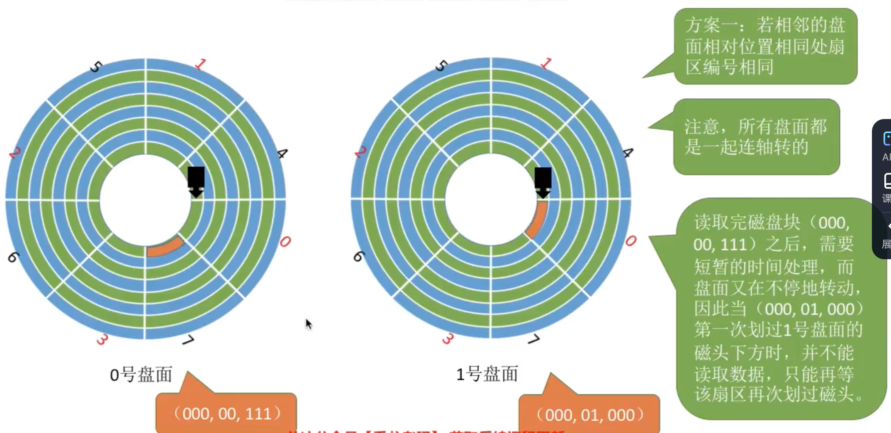

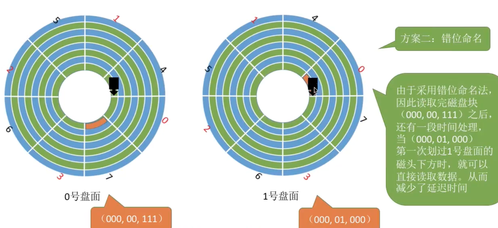

问题：为什么要用（柱面号，盘面号，扇区号）的结构？ 
答：读取地址连续的磁盘块时，采用（柱面号盘面号，扇区号）的地址结构可以减少磁头移动消耗的时间

## 磁盘的管理

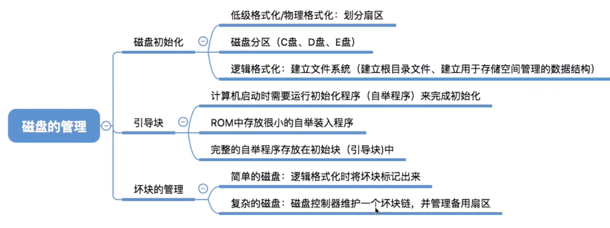

## 固态硬盘

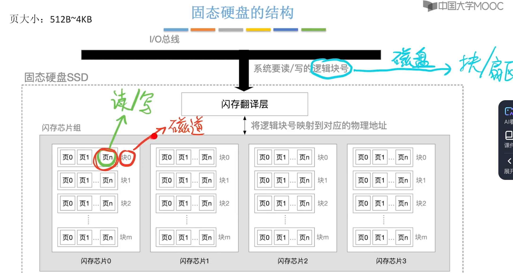

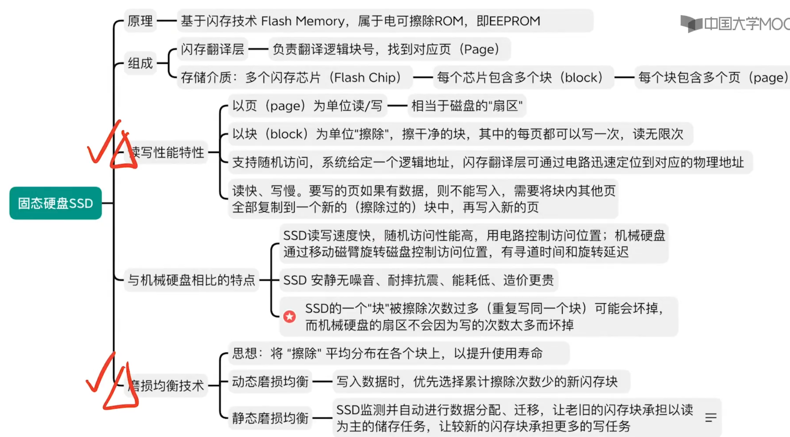

---

**⚠️一些概念和错题知识点整理** 
- 文件的`逻辑结构`是从`用户`观点出发看到的文件的组织形式
- `UNIX`采用`文件名和文件描述信息分开`的方法，文件描述信息单独形成一个称为索引节点的数据结构
- `硬链接和软链接`每增加一个链接就会增加`一个文件名`，在遍历整个文件系统的时候`会多次遍历到同一个文件`
- `硬链接比软链接快`
- 从`用户`的角度看，操作系统引入文件系统的`目的是实现对文件的按名存取`
- `UNIX`操作系统中，`输入输出设备视为特殊文件`
- 文件的`逻辑结构`是`方便用户`设计的
- `建立软链接时，复制引用计数器`
- 不同进程只维护`自己的用户文件打开表`
- 不同用户通过（硬/软链接）打开的同一文件`读写指针的位置也不一定相同（表项不一定相同）`
- 文件被用户进程`首次`打开的过程中，操作系统将`文件控制块读到内存`中

- 在利用`顺序检索`法时，可以从`当前目录`开始查找
- `散列检索法`不利于对文件的`顺序检索`，也不利于`文件枚举`，一般采用`线性检索法`
- 顺序检索法完成后，得到的是文件逻辑地址
- `FAT`可以用`特殊的数字来约定空闲块`（即能用FAT表示空闲块）
- 用来表示节点的大小为xB，则代表该节点一共有2的8*x次方项。例如表项用来存放簇号，每项占2B，则系统中共有2的16次方个簇
- `FAT整个系统只有一张`
- `内存中设置磁盘高速缓存的目的是减少磁盘IO次数`
- `逻辑记录是对文件进行存取操作的基本单位`
- `打开文件是把文件的信息目录复制放到打开文件表中`
- 文件的`顺序存取是按文件的逻辑号`逐一存取

- `磁盘是分时共享设备`
- `调度算法决定寻找时间`
- `延迟时间和传输时间和磁盘转速线性相关`
- 拥有`启动分区`的磁盘称为`启动磁盘`或`系统磁盘`
- `旋转延迟`的大小取决于`磁盘空闲空间`的分配程序
- `旋转延迟`的大小与文件的`物理结构`有关
- `不会导致磁臂黏`着的是`先来先服务`
