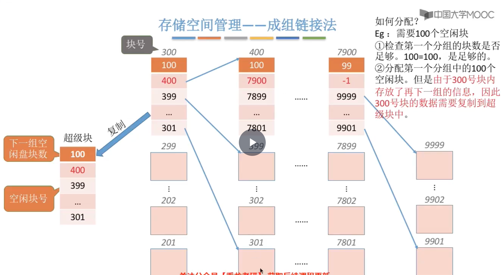

# 文件管理

## 初识文件管理
本章节大概内容：

## 文件的逻辑结构
根据有无结构，文件可分为无结构文件和有结构文件 
无结构文件：文件内部的数据由一系列二进制流或字符流组成，又称`流式文件`（如.txt文件） 
有结构文件：由一组相似的记录组成，又称“记录式文件”。每条记录又若干个数据项组成。如： 数据库表文件。一般来说，每条记录有一个数据项可作为`关键字`。根据各条记录的长度（占用的存储空间）是否相等，又可分为`定长记录和可变长记录`两种。 

顺序文件：一般指顺序存储的文件

索引文件：指的是索引表，是定长记录的顺序文件，按关键字索引的话，可以快速检索记录

索引顺序文件：将记录分组，每组对应一个索引表项，检索记录时先顺序查索引表，找到分组，再顺序查找分组。当记录过多时，可建立多级索引表（会计算查找次数）

## 文件目录
目录文件是一种特殊的文件 
一个文件对应一个FCB，一个FCB就是一个目录项，由FCB的集合组成了文件目录 
对目录的操作：搜索、创建文件、删除文件、显式文件、修改文件 

目录结构：
- 单级目录结构：一个系统只有一张目录表，不允许文件重名
- 两级目录结构：一个系统有两张目录表，不同用户的文件可以重名，但不能对文件进行分类（因为所有文件都在第二级目录）
- 多级（树形）目录结构：
  - 不同目录下的文件可以重名，可以对文件进行分类，不方便文件共享
  - 系统根据文件路径找到目标文件
  - 从根目录出发路径是绝对路径；从当前目录出发的路径是相对路径（可以减少磁盘I/O）
- 无环图目录结构：
  - 在树形目录的基础上，增加一些指向同一节点的有向边
  - 为共享节点设置一个共享计数器，当共享计数器为0时，才真正删除该节点

索引结点：除文件名外，所有信息都放在索引结点；目录项中只包含文件名、索引结点指针，因此每个目录项的长度大幅减小，可以使每个磁盘块存放更多的目录项，从而检索文件磁盘I/O次数减少

## 文件的物理结构（文件的分配方式）
操作系统为文件分配存储空间都是以块为单位的 

连续分配：要求每个文件在磁盘上占有一组连续的块 
- 优点：`支持顺序访问和直接访问`（随机访问），这种方式随机访问时是最快的
- 缺点：不方便文件拓展，存储空间利用率低，会产生磁盘碎片

⚠️考试中默认链接分配是隐式的
隐式链接分配：除文件最后一个盘块外，每个盘块中都存有指向下一个盘块的指针。文件目录记录了第一块指针和最后一块指针
- 优点：方便文件拓展，存储空间利用率高，不会产生磁盘碎片
- 缺点：`不支持随机访问`，只能顺序访问（读入i号逻辑块需要i+1次磁盘I/O），查找效率低，指向下一个盘块的指针占用了存储空间

显式链接分配：磁盘中的所有块的指针都显式的存放在一张表中（文件分配表，FAT）
FAT：一个磁盘仅有一张FAT，开机时，将FAT读入内存，并常驻内存。因为表项在物理上连续存储，且长度一样，所以`物理块号`可以是`隐含的`

优点：很方便文件拓展，不会有碎片，外存利用率高，`支持随机访问`，相比于隐式链接，`地址转换不需要访问磁盘，因此文件访问效率更高`
缺点：文件分配表会占用一定存储空间

索引分配：文件离散的分配在各个磁盘块中，系统会`为每个文件建立一张索引表`，索引表中`记录了文件各逻辑块对应的物理块`，索引表存放的磁盘块称为`索引块`。文件数据存放的磁盘块称为`数据块`
假设一个磁盘块1KB，一个索引表项4B，则一个磁盘块能存256个索引项，但是一个文件的大小超过256块，一个磁盘块就装不下一张索引表了，三种解决方式：
1. 链接方案：可以将多个索引块链接起来
缺点：想要找到i号索引块，必须先依次读入0~i-1号索引块，查找效率低

2. 多层索引：建立多层索引（类似于多级页表），采用`K层索引`，`且顶级索引表未调入内存`，则访问一个数据块`只需K+1次磁盘I/O`
缺点：即使小文件，访问一个数据块依然需要K+1次磁盘I/O

3. 混合索引：多种索引分配方式结合（顶级索引表中包好直接地址、一级间接地址、二级间接地址）

⭐️⭐️⭐️会计算文件的最大长度，会分析访问某个块需要的读磁盘次数⭐️⭐️⭐️

## 文件存储空间的管理
存储空间的划分：将物理磁盘划分为一个个文件卷（逻辑卷、逻辑盘） 
存储空间的初始化：将各个文件卷划分为目录区、文件区 
目录区主要存放目录信息、用于磁盘空间管理的信息，文件区主要存放文件数据 

文件存储空间的管理：`空闲表法`、`空闲链表法`、`位示图法`、`成组链接法` 
空闲表法：使用`空间盘块表`记录空闲盘块

空闲链表法：
- 空闲盘块链：以盘块为单位组成一条空闲链
- 空闲盘区链：以盘区为单位组成一条空闲链

位示图法：每个二进制位对应一个盘块，可以用0表示空闲，1表示占用
⭐️⭐️⭐️盘块号和（字号，位号）的转换⭐️⭐️⭐️

如何分配，需要K个块？ 
1. 顺序扫描位示图，找到K个相邻或不相邻的“0”
2. 根据字号、位号算出对应的盘块号，将相应盘块分配给文件
3. 将相应位设置为“1”
如何回收？ 
1. 根据回收的盘块号计算出对应的字号、位号
2. 将相应位设置为“0”

成组链接法：文件卷的`目录区`中专门用一个磁盘块作为`超级块`，系统启动时需要将超级块读入内存，并且要保证数据一致（UNIX采用的策略适用于大型文件系统） 
- 超级块永远指向第一个分组
- 在超级块和每一个分组的第一个块中需要记录下一个分组空闲盘块的信息
- 一个分组中的块号不需要连续
- 若已经没有下一个空闲块，可以将记录值设为特殊值（-1） 
如何分配？ 

如何回收？ 

## 文件的基本操作
