# 输入输出管理

## I/O的概念和分类

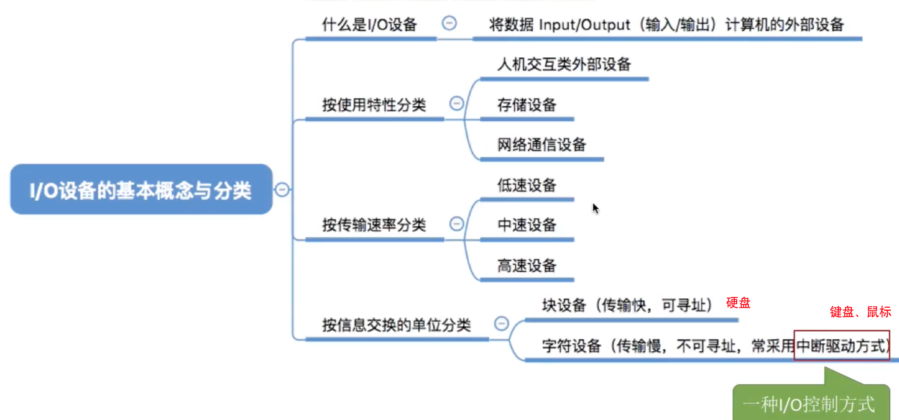

## I/O控制器
这部分计组中学过

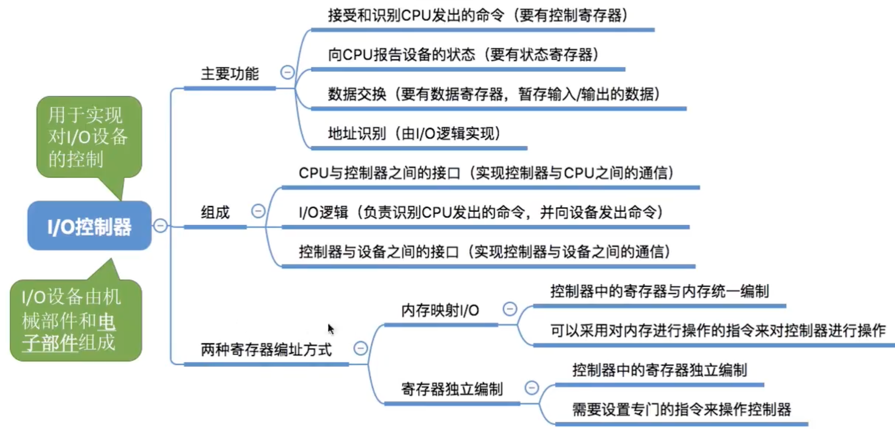

## I/O控制方式
和计组对比学习（主要是各种方式的基本流程，对比one note笔记）

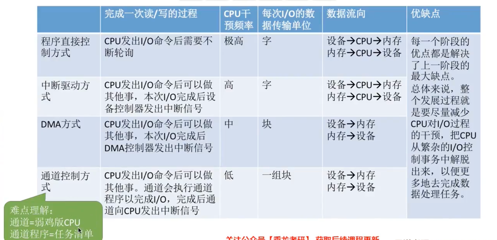

一个通道可以控制多个I/O控制器，一个I/O控制器可以控制多个I/O设备

问题：DMA方式与中断控制方式的主要区别是什么？
1. 中断控制方式在每个数据传送完成后中断CPU,而DMA控制方式则在所要求传送的一批数据全部传送结束时中断CPU。
2. 中断控制方式的数据传送在中断处理时由CPU控制完成，而DMA控制方式则在DMA控制器的控制下完成。不过，在DMA控制方式中，数据传送的方向、存放数据的内存始址及传送数据的长度等仍然由CPU控制。
3. DMA方式以存储器为核心，中断控制方式以CPU为核心。因此DMA方式能与CPU并行工作。
4. DMA方式传输批量的数据，中断控制方式的传输则以字节为单位。

问题：DMA方式与通道方式的主要区别是什么？
1. 在DMA控制方式中，在DMA控制器控制下设备和主存之间可以成批地进行数据交换而不用CPU干预，这样既减轻了CPU的负担，又大大提高了I/O数据传送的速度。通道控制方式与DMA控制方式类似，也是一种以内存为中心实现设备与内存直接交换数据的控制方式。
2. 不过在通道控制方式中，CPU只需发出启动指令，指出通道相应的操作和I/O设备，该指令就可以启动通道并使通道从内存中调出相应的通道程序执行。
3. 与DMA控制方式相比，通道控制方式所需的CPU干预更少，并且一个通道控制多台设备，进一步减轻了CPU的负担。另外对通道来说，可以使用一些指令灵活改变通道程序，这点DMA 控制方式无法做到。

## I/O软件层次结构

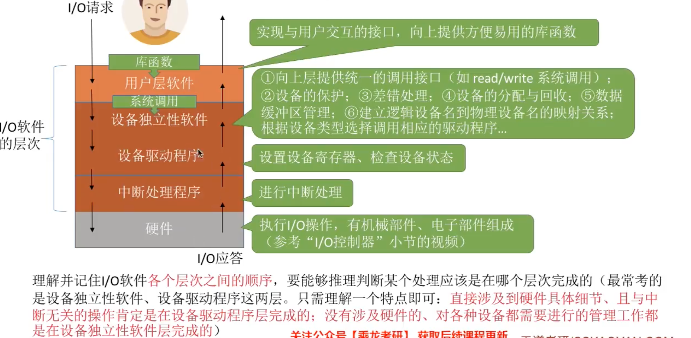

根据逻辑设备表找到对应的驱动程序入口：

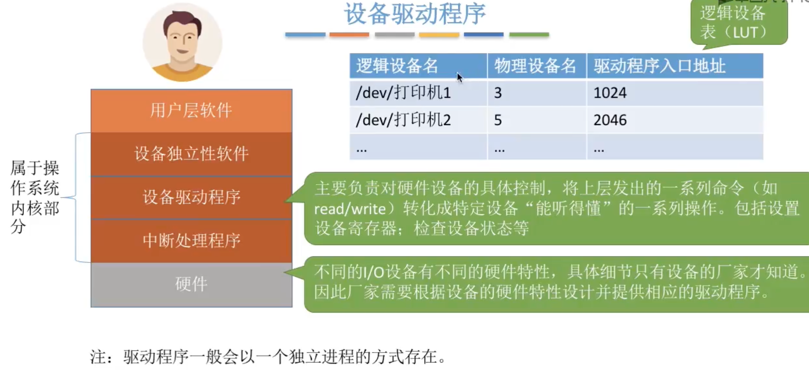

## 输入输出应用程序接口和驱动程序接口
三种应用程序接口：字符设备接口、块设备接口、网络设备接口 
字符型设备没有地址的概念，所以就不需要提供地址参数，而块设备需要提供地址参数 

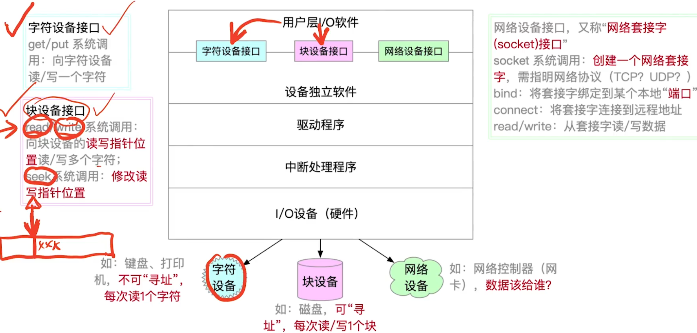

网络设备传输数据大致过程：用户进程通过fd将数据复制到内核空间的数据缓冲区中（由设备独立性软件完成），然后设备独立性软件会调用网络控制器驱动程序，将复制的数据转移到网络设备上，然后网络控制器就可以将数据包发到网络上...

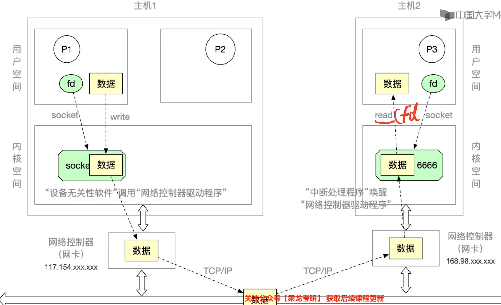

阻塞和非阻塞IO：

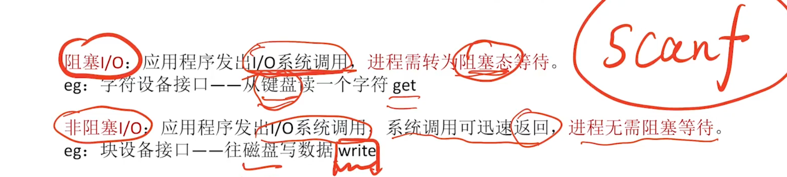

设备驱动程序接口：

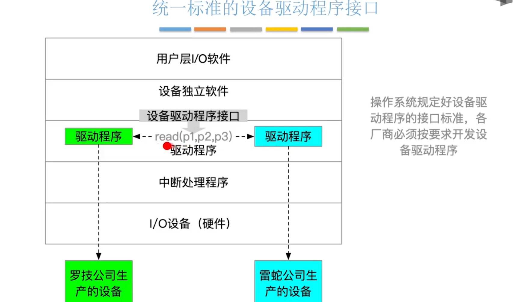

**⚠️一些概念和错题知识点整理** 
- `共享设备`必须是`可寻址`的和`可随机访问`的设备
- `共享设备`是指`一段时间内允许多个进程同时访问`的设备
- `虚拟设备`是指把一个`物理设备`变换成多个对应的逻辑设备
- 为了便于上层软件的编制，`设备控制器`通常需要提供`控制寄存器、状态寄存器和控制命令`
- `字节多路通道用作连接大量的低速或中速I/O设备`
- 将系统中的每台设备按某种原则统一进行编号，这些编号作为区分硬件和识别设备的代号，该编号称为设备的`绝对号`
- `通道控制设备管理器、设备管理器控制设备工作`
- `通道`是处理输入/输出的`硬件`

---

## IO核心子系统
总览：

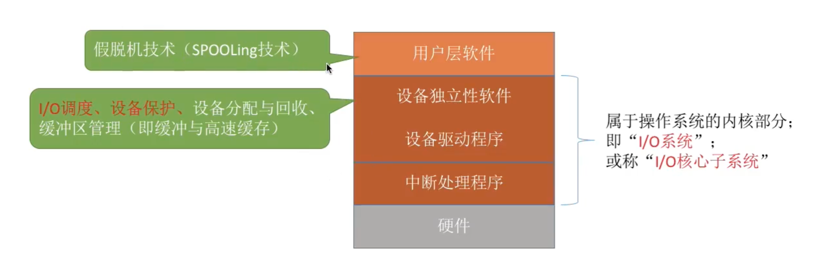

I/O调度：用某种算法确定一个好的顺序来处理各个I/O请求（如磁盘调度，先来先服务、最短寻道时间优先...）

设备保护：设备被当做一种特殊的文件，每个设备也有对应的FCB，用户在请求访问某个设备时，系统根据FCB中记录的信息判断用户是否有权限访问该设备

### 假脱机技术（SPOOLing技术）

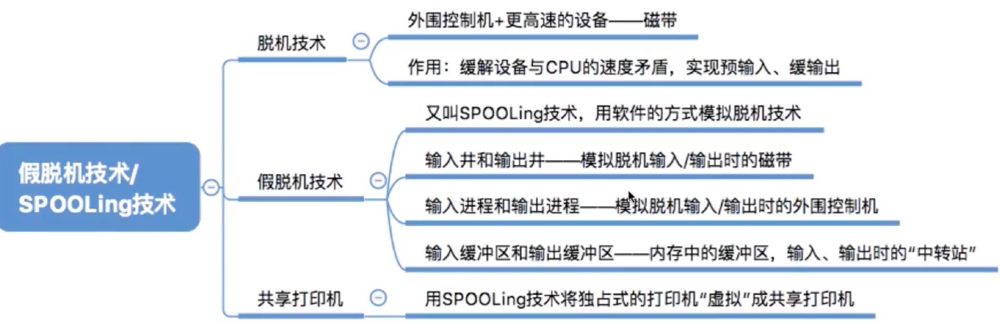

### 设备的分配与回收
看one note笔记

### 缓冲区管理
缓冲区是一种临界资源，可以由硬件缓冲器实现或者采用使用内存缓冲区 

缓冲技术：

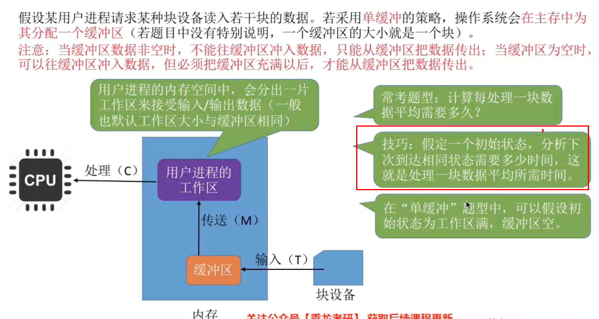

单缓冲：处理一块数据平均耗时`Max(C, T) + M`

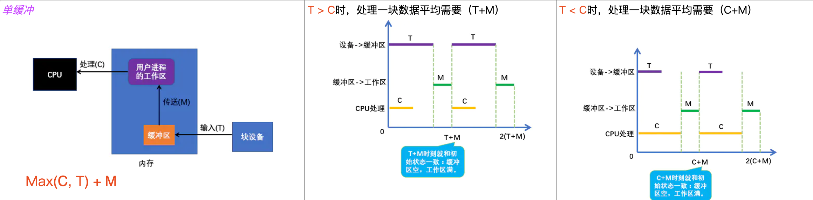

双缓冲：处理一块数据平均耗时`Max(T, C+M)`

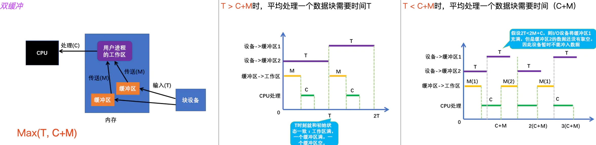

循环缓冲：

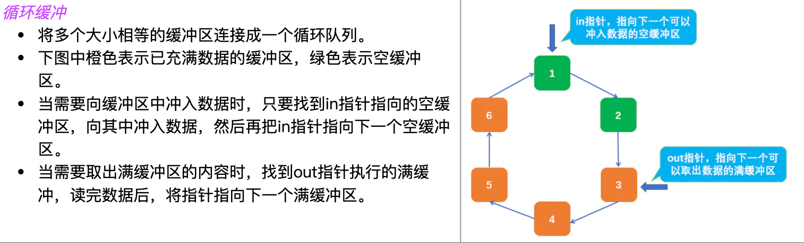

缓冲池：

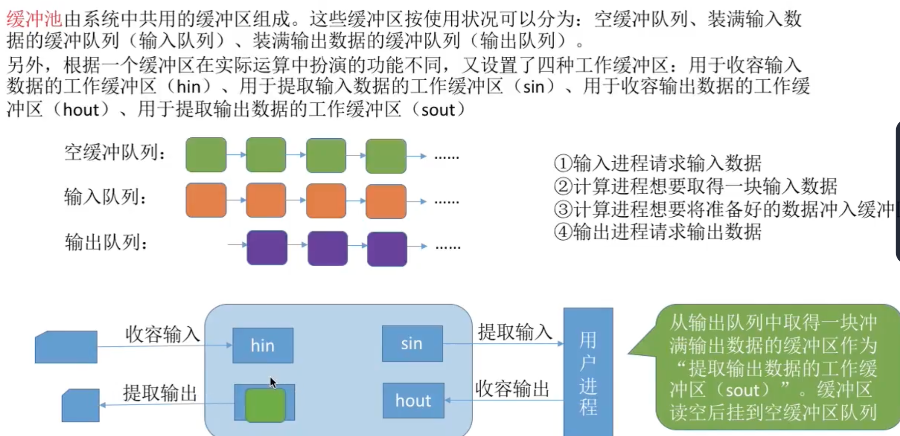

**⚠️一些概念和错题知识点整理** 
- 单用户计算机上需要使用`缓冲技术`的是`图形用户界面下使用鼠标，多任务操作系统下的磁带驱动器（假设没有设备预分配），包含用户文件的磁盘驱动器，使用存储器映射I/O，直接和总线相连的图形卡`
- `采用SPOOLing技术`的系统`不需要外围计算机`
- SPOOLing技术的特点
  - 提高了I/O速度
  - 将独占设备改造为共享设备
  - 实现了虚拟设备功能

问：用于设备分配的数据结构有哪些？它们之间的关系是什么？ 
用于设备分配的数据结构有系统设备表(SDT)、设备控制表(DCT)、控制器控制表(COCT)和通道控制表(CHCT)。 
SDT整个系统中只有一张，它记录系统中全部设备的情况，是系统范围的数据结构。每个设备有一张DCT，系统为每个设备配置张DCT， 以记录本设备的情况。每个控制器有一张COCT，系统为每个控制器都设置一张用于记录本控制器情况的COCT。系统为每个通道配置一张CHCT，以记录通道情况。SDT中有一个DCT指针，DCT中的每个表目有一个指向COCT的指针，COCT中有一个CHCT指针，CHCT中有一个COCT指针。
